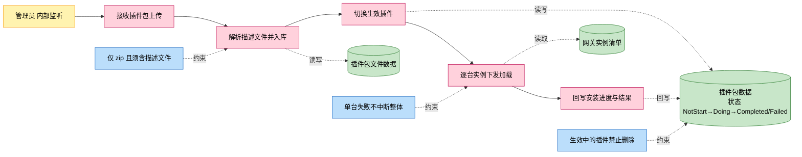
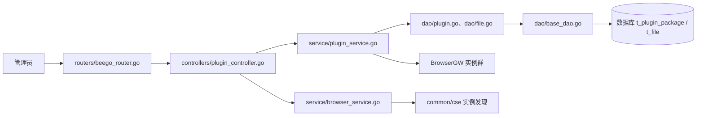
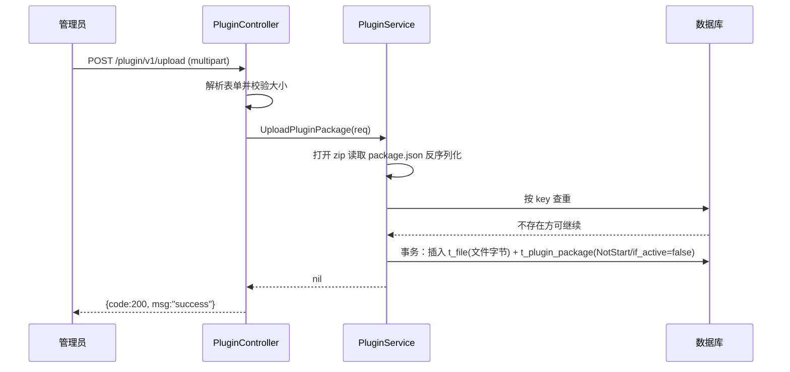
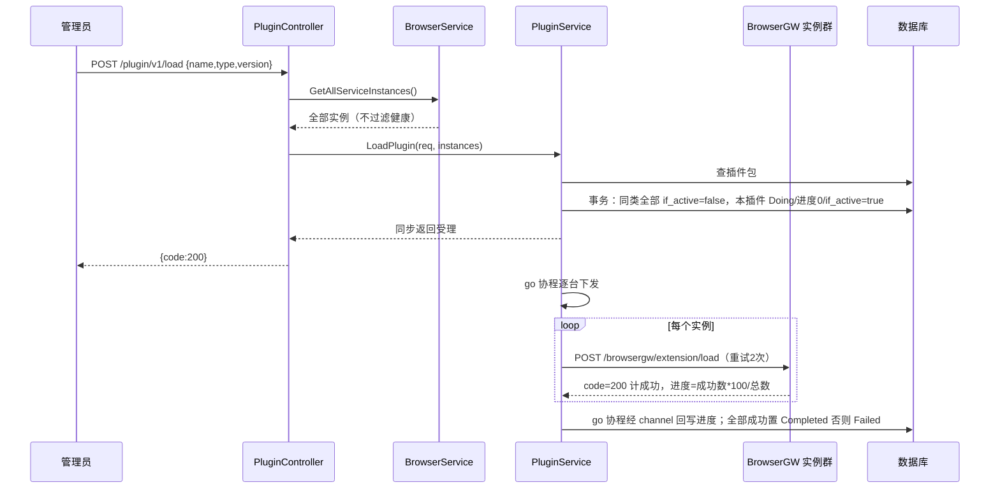

# 插件管理

> 功能域概述：管理浏览器插件包的上传、删除、查询与加载下发，把指定插件包异步加载到全部浏览器网关实例，并维护插件生效状态与安装进度。
> 接口数：6（内部 5 / 出向 1）　核心模块：controllers/plugin_controller.go, service/plugin_service.go, dao

## 1. 功能故事（多彩建模）

实现逻辑速览：

上传 zip 插件包，解析描述文件后入库。
加载时切换生效插件，异步逐台下发实例。
全部装完置为完成，否则标记失败。

术语表：

| 术语 | 人话解释 | 出处 |
|---|---|---|
| 插件包 | 浏览器扩展的 zip 压缩包，含可执行内容与描述文件 | src/service/plugin_service.go |
| 描述文件 | zip 内名为 package.json 的文件，记录插件名/版本/类型 | src/common/constants/base.go |
| 生效插件 | 同类插件中 if_active 为 true、当前要下发使用的那一个 | src/models/db/plugin_info.go |
| ActiveStatus | 插件安装状态枚举：NotStart/Doing/Completed/Failed | src/models/db/plugin_info.go |
| ChromeExtend | 目前唯一支持的插件类型，值 "ChromeExtend" | src/common/constants/base.go |
| BrowserGW | 浏览器网关实例，插件最终加载到的执行载体 | src/models/browsergateway/service_instance.go |
| CSE | 微服务注册发现组件，用于获取 BrowserGW 实例清单 | src/common/cse/cse.go |
| 就绪实例 | 插件状态 Completed、容量有余、健康在线的实例 | src/service/browser_service.go |

## 2. 模块划分

| 模块 | 承载功能（引用文件） |
|---|---|
| controllers/plugin_controller.go | 路由表声明、multipart/JSON 入参解析、panic 兜底恢复、响应封装（src/controllers/plugin_controller.go） |
| controllers/controller.go | 基类约定：请求体反序列化+校验、OK/Failed/500 统一响应（src/controllers/controller.go） |
| service/plugin_service.go | 插件包解析、查重入库、生效切换事务、异步下发与进度回写（src/service/plugin_service.go） |
| service/browser_service.go | 提供 BrowserGW 实例清单（全量）；就绪实例过滤依赖插件状态（src/service/browser_service.go） |
| dao/plugin.go、dao/file.go | 插件表、文件表的数据访问对象（src/dao/plugin.go、src/dao/file.go） |
| dao/base_dao.go | ORM 基础增删改查与事务执行（src/dao/base_dao.go） |

## 3. 接口清单

| 接口 | 路径/入口（含注册处） | 请求结构 | 响应结构 | 状态 |
|---|---|---|---|---|
| UploadPluginPackage | POST /plugin/v1/upload；入口 src/controllers/plugin_controller.go；注册 src/routers/beego_router.go（仅内部监听） | multipart/form-data：file 文件必填、filename 可空（回退文件头名）；UploadPluginPackageReq（src/models/req/plugin_entity.go）：大小须 0<Size≤300MB | BaseResponse（src/models/resp/base.go）：{code, msg} | 在用 |
| DeletePluginPackage | POST /plugin/v1/delete；入口 src/controllers/plugin_controller.go；注册 src/routers/beego_router.go | PluginPackageReq（src/models/req/plugin_entity.go）：{name, type, version} 均必填 | BaseResponse（src/models/resp/base.go）：{code, msg} | 在用 |
| GetPluginPackages | POST /plugin/v1/getAll；入口 src/controllers/plugin_controller.go；注册 src/routers/beego_router.go | 无请求体 | []db.PluginPackage JSON 数组（src/models/db/plugin_info.go） | 在用 |
| LoadPlugin | POST /plugin/v1/load；入口 src/controllers/plugin_controller.go；注册 src/routers/beego_router.go | PluginPackageReq（src/models/req/plugin_entity.go）：{name, type, version} 均必填 | BaseResponse（src/models/resp/base.go）：同步仅受理，结果异步回写 | 在用 |
| GetCurrentPlugins | POST /plugin/v1/current；入口 src/controllers/plugin_controller.go；注册 src/routers/beego_router.go | 无请求体 | []db.PluginPackage JSON 数组（src/models/db/plugin_info.go） | 在用 |
| （出向）BrowserGW 加载插件 | POST http://{BrowserInnerEndpoint}/browsergw/extension/load（src/service/plugin_service.go） | ExtensionLoadRequest（src/models/browsergateway/req.go）：{bucket_name, extension_file_path, name, version, type}；失败重试 2 次 | ExtensionLoadResponse（src/models/browsergateway/resp.go）：{code, message, data}，要求 HTTP 成功且 code=200 | 在用 |

## 4. 关键数据结构

| 结构 | 定义位置 | 关键字段（含义+约束） |
|---|---|---|
| PluginPackage（表 t_plugin_package） | src/models/db/plugin_info.go | Field（主键 key，拼接规则 type:name:version）；Name/Version/Type（Type 须为 ChromeExtend）；PackageName（zip 文件名）；PackageBucket（固定 "extension"）；Status（ActiveStatus 枚举）；IfActive（是否生效，同类仅一个为 true）；Progress（0-100） |
| ActiveStatus（枚举） | src/models/db/plugin_info.go | NotStart=未开始；Doing=安装中；Completed=已完成；Failed=失败 |
| File（表 t_file） | src/models/db/file.go | Bucket+Name（定位文件）；Content（bytea 存 zip 全量字节）；Size |
| UploadPluginPackageReq | src/models/req/plugin_entity.go | Filename（可空，回退文件头名）；File（multipart 文件流，必填）；Size（>0 且 ≤300MB） |
| PluginPackageReq | src/models/req/plugin_entity.go | Name/Type/Version 三字段均必填；Key 拼接为 type:name:version |
| ExtensionLoadRequest | src/models/browsergateway/req.go | BucketName/ExtensionFilePath（文件定位）；Name/Version/Type（插件标识） |
| ServiceInstance | src/models/browsergateway/service_instance.go | BrowserInnerEndpoint（内网地址，出向调用目标）；PluginStatus（实例插件状态）；Cap/Used/IsHealthy |

## 5. 调用关系

主链路一：上传插件包

主链路二：加载插件（异步下发）

关键分支与异步环节（各一句，带证据文件）：

- 仅接受 .zip，且包内必须有 package.json，否则报错（src/service/plugin_service.go）
- 描述文件超大、类型非 ChromeExtend、名/版本为空均拒绝（src/service/plugin_service.go）
- 同 key 插件已存在时禁止重复上传（src/service/plugin_service.go）
- 参数解析/校验失败返回 code=-2（src/controllers/plugin_controller.go、src/common/constants/retcode/retcode.go）
- 生效切换事务失败仅记日志仍返回成功（src/service/plugin_service.go）
- 单台实例失败跳过不中断；结束未达 100% 置 Failed（src/service/plugin_service.go）
- 生效中（IfActive）插件禁止删除；删除不存在的插件视为成功（src/service/plugin_service.go）
- 上传接口 panic 被 recover 吞掉只记日志，调用方可能收不到响应（src/controllers/plugin_controller.go）
- 明确不走：加载取全量实例而非就绪实例过滤后的清单（src/controllers/plugin_controller.go、src/service/browser_service.go）

## 6. 框架引用

| 基础框架 | 框架文档 | 本功能中的用途（引用文件） |
|---|---|---|
| Beego Web 路由/Controller | [rpc-beego-web.md](../framework-usage/rpc-beego-web.md) | 路由注册与请求处理（src/routers/beego_router.go、src/controllers/plugin_controller.go、src/controllers/controller.go） |
| Beego ORM 存储 | [storage-beego-orm.md](../framework-usage/storage-beego-orm.md) | 插件表/文件表 CRUD 与多表事务（src/dao/base_dao.go、src/dao/plugin.go、src/dao/file.go、src/models/db/plugin_info.go） |
| HTTP 客户端构建器 | [rpc-http-client-builder.md](../framework-usage/rpc-http-client-builder.md) | 出向调用链式构建与重试（src/common/https/builder.go、src/service/plugin_service.go） |
| goroutine 并发 | [concurrency-goroutine.md](../framework-usage/concurrency-goroutine.md) | 异步下发与 channel 进度回写（src/service/plugin_service.go） |
| CSE 注册发现 | [resilience-cse-gsf.md](../framework-usage/resilience-cse-gsf.md) | 获取 BrowserGW 实例清单（src/common/cse/cse.go、src/service/browser_service.go） |
| JSON 编解码 | [codec-json-yaml.md](../framework-usage/codec-json-yaml.md) | 描述文件与请求体反序列化（src/service/plugin_service.go、src/controllers/controller.go） |
| lager 日志 | [log-lager-auditlog-event.md](../framework-usage/log-lager-auditlog-event.md) | 全链路日志记录（src/controllers/plugin_controller.go、src/service/plugin_service.go） |

## 7. AI 编码指南

- 插件主键固定 type:name:version 拼接，勿改顺序（src/models/db/plugin_info.go）
- 文件与元数据双写必须放同一事务内（src/service/plugin_service.go）
- 加载接口同步只受理，状态经 channel 异步回写（src/service/plugin_service.go）
- 删插件前先判 IfActive，生效中禁止删除（src/service/plugin_service.go）
- 插件状态 Completed 才计入就绪实例参与分流（src/service/browser_service.go）
