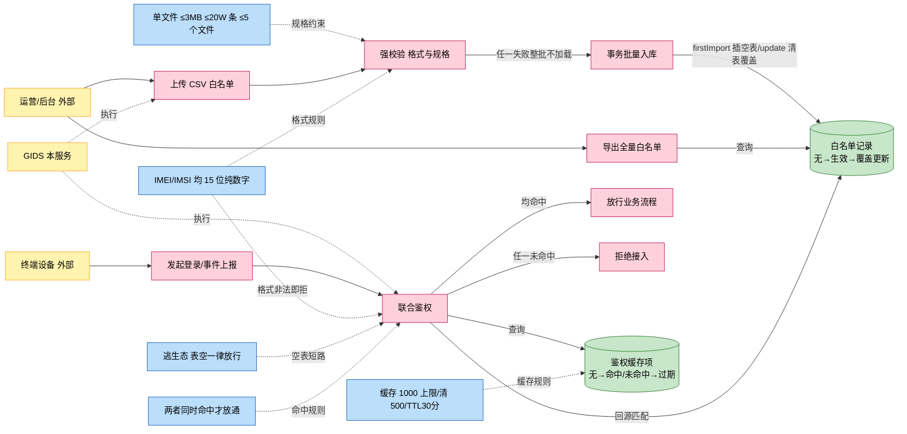
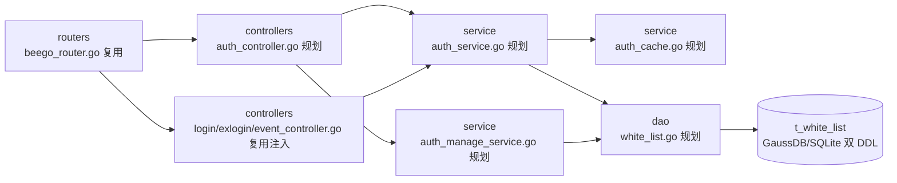
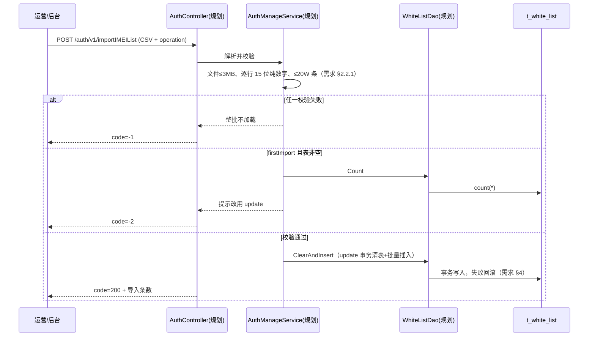
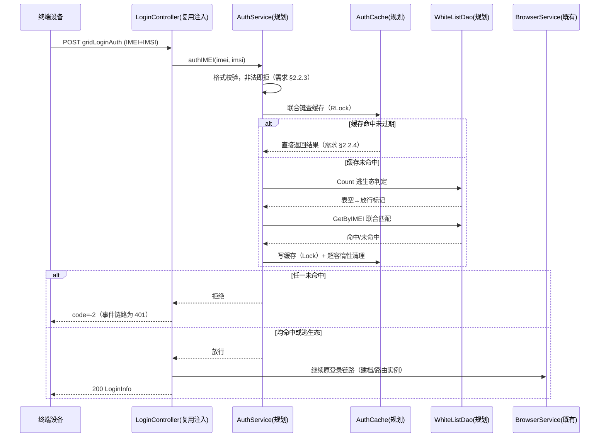

# 终端鉴权

> 功能域概述：27.0 商用补齐——通过白名单 CSV 导入 + IMEI/IMSI 联合鉴权 + 逃生态机制，确保只有授权终端能接入云手机实例，杜绝未授权设备白嫖资源。
> 接口数：3 个新增（设计中）+ 4 个既有链路注入点　核心模块：controllers(auth)、service(auth/auth_manage)、dao(white_list)、common 缓存组件
> 来源：docs/27.0/终端鉴权/27.0终端鉴权需求设计文档.md（下称"需求"）

## 1. 功能故事（多彩建模）

实现逻辑速览：

白名单双因子联合鉴权，空表逃生态全放行。
鉴权结果内存缓存三十分钟，超容惰性清理。
CSV 导入强校验，任一失败整批不加载。

业务背景说明：JWT 校验为长期方案、本版本选型白名单 CSV（需求 §1.4）；DB 能否支撑 100W 静态用户**需求未明确，待详设实测确认**（需求 §2.2.1）。

术语表：

| 术语 | 人话解释 | 出处 |
|---|---|---|
| IMEI | 设备本身的 15 位数字身份号码，标识"哪台设备" | 需求 §8 |
| IMSI | 手机卡的 15 位数字身份号码，标识"哪个用户" | 需求 §8 |
| 联合鉴权 | IMEI 与 IMSI 必须同时命中白名单才放通，防单一标识伪造 | 需求 §2.2.3 |
| 白名单 | 运营按合同批次维护的授权终端清单，逐条精确匹配 | 需求 §1.4 |
| 逃生态 | 白名单表为空时一律放行，避免未配置导致全量阻断 | 需求 §2.2.3 |
| firstImport | 首次导入模式，要求白名单表为空，否则报错提示用 update | 需求 §2.2.1 |
| update | 覆盖更新模式，事务清表后批量插入新白名单 | 需求 §2.2.1 |
| 缓存穿透防护 | 未命中组合也缓存 false 结果，防止反复回源 DB | 需求 §2.2.4 |
| 惰性清理 | 写入后发现超容量才顺手删最旧条目，不起独立线程 | 需求 §2.2.4 |
| Luhn 校验 | IMEI 第 15 位（SP 备用位）的校验算法 | 需求 §1.4 |

## 2. 模块划分

| 模块 | 承载功能 |
|---|---|
| controllers/auth（规划） | 鉴权/导入/导出三个 HTTP 入口，不做业务逻辑（需求 §2.4） |
| controllers login/exlogin/event（复用注入） | 登录与事件链路注入鉴权调用（需求 §3，复用 src/controllers/login_controller.go、src/controllers/exlogin_controller.go、src/controllers/event_controller.go） |
| service/auth_service（规划） | 鉴权决策：格式校验+逃生态+缓存查询+联合匹配（需求 §2.4） |
| service/auth_manage_service（规划） | CSV 解析+批量入库（firstImport/update）+导出生成，不做鉴权（需求 §2.4） |
| service/auth_cache（规划） | 命中/未命中/放行结果缓存+惰性清理，不查 DB（需求 §2.4） |
| dao/white_list（规划） | 白名单表读写：Count/GetByIMEI/InsertMulti/ClearAndInsert/ListAll（需求 §2.4） |
| models/db/white_list（规划） | 白名单实体，遵循 orm tag+TableName+init 注册三步曲（复用约定见 src/models/db/user.go） |

## 3. 接口清单

只列对外接口；新增接口注册于内部监听（GIDS 服务 IP，端口 9090，需求 §2.1），状态"设计中"：

| 接口 | 路径/入口 | 请求结构 | 响应结构 | 状态 |
|---|---|---|---|---|
| 终端联合鉴权 | POST /auth/v1/authIMEI（规划 auth_controller） | JSON{imei, imsi} | 均命中 200 / 任一未命中 401（需求 §3） | 设计中 |
| 白名单导入 | POST /auth/v1/importIMEIList（规划 auth_controller） | CSV 文件 + operation=firstImport/update | 成功 code=200+导入条数；校验失败 -1；参数错误 -2（需求 §2.2.1） | 设计中 |
| 白名单导出 | GET /auth/v1/exportIMEIList（规划 auth_controller） | 无 | 全量 CSV 文本（IMEI,IMSI 两列） | 设计中 |
| gridLoginAuth（注入） | POST /app-api/devicetcp/app/login/v1/gridLoginAuth（src/controllers/exlogin_controller.go、src/controllers/login_controller.go） | req.LoginAuthRequest（含 IMEI/IMSI） | 鉴权失败 code=-2（需求 §2.2.3） | 在用，27.0 起注入鉴权 |
| gridLoginAuthOpenBrowser（注入） | POST /app-api/devicetcp/app/login/v1/gridLoginAuthOpenBrowser（同上两文件） | req.LoginAuthRequest | 同上 | 在用，27.0 起注入鉴权 |
| sendClientEvent（注入） | POST /app-api/center/public/client/sendClientEvent（src/controllers/event_controller.go） | 事件上报请求（含 IMEI/IMSI） | 鉴权失败 code=401（需求 §2.2.3） | 在用，27.0 起注入鉴权 |
| sendAppUseTimesEvent（注入） | POST /app-api/center/public/client/sendAppUseTimesEvent（src/controllers/event_controller.go） | 使用时长上报请求 | 同上 | 在用，27.0 起注入鉴权 |

## 4. 关键数据结构

| 结构 | 定义位置 | 关键字段 |
|---|---|---|
| t_white_list 表 | 规划 models/db/white_list.go；DDL 双份（GaussDB+SQLite） | IMEI char(15) 建索引、IMSI char(15) 建索引、IMEI+IMSI 联合索引（需求 §7）；created_at；规格 100W 条 |
| cacheEntry | 规划 service/auth_cache.go | result（命中 true/未命中 false/放行标记）+ expireAt；键=IMEI+IMSI 联合键；容量 1000、超清最旧 500、TTL 30min（需求 §2.2.4） |
| 白名单 CSV 格式 | 需求 §2.2.1 | 两列 IMEI,IMSI，各 15 位纯数字；单文件 ≤3MB、≤20W 行，最多 5 个文件 |
| 鉴权请求/响应 | 规划 models/req、models/resp | 请求 {imei, imsi} 均必填 15 位纯数字；响应 code/message（200/-1/-2/401 语义见接口清单） |

## 5. 调用关系

管理链路（白名单导入）：

业务链路（登录注入联合鉴权）：

关键分支与异步环节：

- 导入为同步事务，整批失败回滚，无异步环节（需求 §4）；update 模式清表+插入同一事务（需求 §2.2.1）。
- 缓存无独立 goroutine，清理在写锁内完成（需求 §2.2.4）；白名单导入后缓存最长 30min 才反映新名单，急需生效靠重启（需求 §2.2.4）。
- 鉴权注入点在 Controller 调原业务 Service 之前；事件上报两接口同样注入（需求 §3）。

## 6. 框架引用

| 基础框架 | 框架文档 | 本功能中的用途（引用文件） |
|---|---|---|
| Beego Web 路由/Controller | [rpc-beego-web.md](../framework-usage/rpc-beego-web.md) | 新 AuthController 按 RouteMapping 注册到内部监听；复用 BaseController 统一响应（src/routers/beego_router.go、src/controllers/controller.go） |
| beego ORM | [storage-beego-orm.md](../framework-usage/storage-beego-orm.md) | 白名单表按 Model→DAO→Service 三步曲实现，继承 BaseInterface；生产 GaussDB 与 LOCAL_MODE SQLite 双 DDL 保持一致（src/dao/base_dao.go、src/dao/db_init.go、src/dao/db_local_sqlite.go） |
| Go 协程与单例 | [concurrency-goroutine.md](../framework-usage/concurrency-goroutine.md) | 鉴权缓存用 sync.RWMutex+map；AuthService/AuthCache 按包级单例装配（需求 §2.2.4，约定见 src/service/event_service.go） |
| 序列化 | [codec-json-yaml.md](../framework-usage/codec-json-yaml.md) | 鉴权请求/响应用 encoding/json；白名单导入导出用 encoding/csv（约定见 src/controllers/controller.go、src/service/traffic_stats_service.go） |
| 日志/审计事件 | [log-lager-auditlog-event.md](../framework-usage/log-lager-auditlog-event.md) | 鉴权拒绝、导入结果、逃生态触发的业务日志（src/common/logger） |
| 测试框架 | [test-testify-goconvey.md](../framework-usage/test-testify-goconvey.md) | DAO/Service 接口注入 mock 单测；LOCAL_MODE SQLite 本地集成测试（需求 §6，src/test） |

## 7. AI 编码指南

- 新接口注册进内部监听 RouteMapping（src/routers/beego_router.go）
- 鉴权注入在调业务 Service 之前（需求 §3）
- 表结构必须双 DDL 同步（src/dao/db_init.go、src/dao/db_local_sqlite.go）
- 缓存禁起独立 goroutine（需求 §2.2.4）
- DAO/Service 走接口注入便于 mock（需求 §6）
