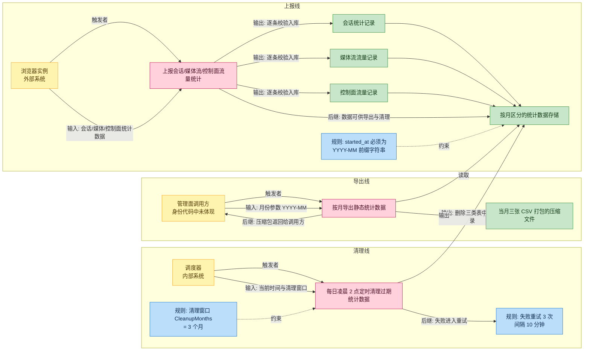
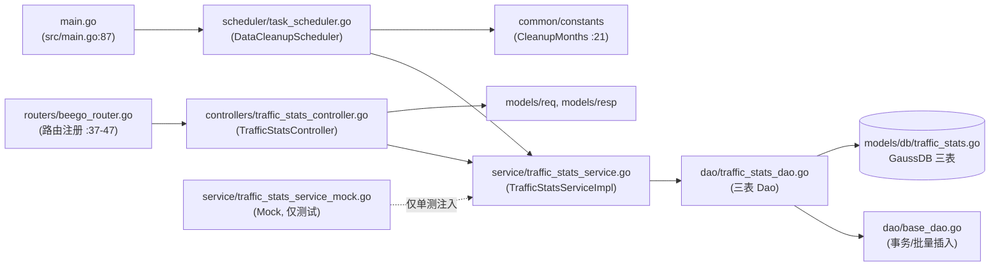
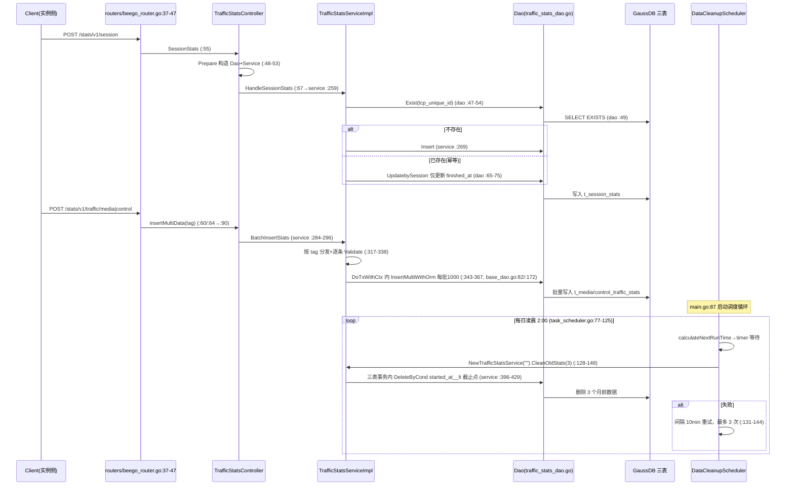

# 流量统计

> 功能域概述：接收实例侧上报的会话/媒体流/控制流统计数据并落库（GaussDB），支持按月导出 CSV 压缩包，并由每日定时任务清理 3 个月前的过期数据。
> 接口数：5（外部 0 / 内部 4 + 定时任务 1）　核心模块：controllers, service, dao, scheduler

## 1. 功能故事（多彩建模）

### 术语表

| 术语 | 人话解释 | 出处 |
|---|---|---|
| 会话统计（SessionStats） | 一次云浏览器会话从接入到结束的过程记录，含接入方式、网络协议、起止时间 | src/models/db/traffic_stats.go:45-52 |
| 媒体流流量统计（MediaTrafficStats） | 会话音视频通道产生了多少字节流量的记录 | src/models/db/traffic_stats.go:9-21 |
| 控制面流量统计（ControlTrafficStats） | 会话控制信令通道产生了多少字节流量的记录 | src/models/db/traffic_stats.go:27-39 |
| tcp_unique_id（幂等键） | 同一条 TCP 连接的唯一编号，重复上报时只更新结束时间、不重复插入 | src/dao/traffic_stats_dao.go:47-54、:65-75 |
| 批量上报（MultiTableRequest） | 一次请求携带多条流量记录，逐条校验后在事务里按 1000 条一批写入 | src/models/req/request_entity.go:154-156、src/service/traffic_stats_service.go:343-367 |
| 按月导出（exportStaticData） | 传入"年-月"，把当月三张统计表导成 CSV 打成 zip 返回 | src/controllers/traffic_stats_controller.go:26、:115-156 |
| 清理窗口（CleanupMonths） | 统计数据保留几个月，当前固定为 3 个月，超期即被定时任务删除 | src/common/constants/base.go:21 |
| 内部监听（127.0.0.1:9090） | 本功能域接口只对本机内部开放，不对外暴露 | src/routers/beego_router.go:28-47 |
| started_at 前缀过滤 | 用字符串开头匹配判断记录属于哪个月，无物理按月分区 | src/service/traffic_stats_service.go:238 |
| 上报方身份/鉴权方式 | 上报与导出的调用方身份、鉴权机制代码中未体现 | 代码中未体现 |

## 2. 模块划分

| 模块/包 | 承载功能 |
|---|---|
| controllers（TrafficStatsController） | 4 个 HTTP 入口：路由注册、解析校验、导出 zip 组装（src/controllers/traffic_stats_controller.go:37-46、:115-156） |
| service（TrafficStatsService/Impl） | 业务编排：会话插入或更新、批量事务插入、CSV 分批导出、过期清理（src/service/traffic_stats_service.go:35-48、:259-429） |
| service（TrafficStatsServiceMock） | 接口假实现，仅供单元测试（src/service/traffic_stats_service_mock.go:13-71） |
| dao（三张统计表 Dao） | t_session_stats / t_media_traffic_stats / t_control_traffic_stats 的 CRUD 与原生 SQL 查询（src/dao/traffic_stats_dao.go:11-75） |
| scheduler（DataCleanupScheduler） | 每日凌晨 2:00 调度清理，失败重试 3 次（src/scheduler/task_scheduler.go:38-59、:114-148） |
| models/db | 三张统计表 ORM 实体（src/models/db/traffic_stats.go:9-66） |
| common/constants | 清理窗口常量 CleanupMonths = 3（src/common/constants/base.go:21） |

## 3. 接口清单

| 接口 | 路径/入口（含注册处） | 请求结构 | 响应结构 | 状态 |
|---|---|---|---|---|
| 会话统计上报 | POST /stats/v1/session（src/controllers/traffic_stats_controller.go:40，注册 src/routers/beego_router.go:37、:44-47） | db.SessionStats（src/models/db/traffic_stats.go:45-52） | resp.BaseResponse OK（src/controllers/controller.go:92） | 在用（内部 127.0.0.1:9090） |
| 媒体流流量统计上报 | POST /stats/v1/traffic/media（src/controllers/traffic_stats_controller.go:41） | req.MultiTableRequest{Items: []MediaTrafficStats}（src/models/req/request_entity.go:154-156、src/models/db/traffic_stats.go:9-21） | resp.BaseResponse OK / Failed（controller.go:92、:112） | 在用（内部） |
| 控制流流量统计上报 | POST /stats/v1/traffic/control（src/controllers/traffic_stats_controller.go:42） | req.MultiTableRequest{Items: []ControlTrafficStats}（src/models/db/traffic_stats.go:27-39） | resp.BaseResponse OK / Failed | 在用（内部） |
| 按月导出统计数据 | GET /stats/v1/exportStaticData/:month（src/controllers/traffic_stats_controller.go:43） | 路径参数 month，格式 "2006-01"（src/controllers/traffic_stats_controller.go:26、:119-121） | zip 附件流（3 个 CSV，:143、:190-202） | 在用（内部） |
| 过期统计数据清理（定时任务） | 非 HTTP，每日凌晨 2:00（src/scheduler/task_scheduler.go:38，启动 src/main.go:87） | constants.CleanupMonths=3（src/common/constants/base.go:21） | 删除三表过期行，日志记录（src/service/traffic_stats_service.go:384-391） | 在用 |

### 语言级内部接口：TrafficStatsService

| 接口 | 定义位置 | 实现 | 选择机制（含 mock） |
|---|---|---|---|
| TrafficStatsService（10 方法） | src/service/traffic_stats_service.go:35-48 | 1) TrafficStatsServiceImpl（:50，构造 NewTrafficStatsService :61 返回具体类型）；2) TrafficStatsServiceMock（src/service/traffic_stats_service_mock.go:13-71） | 无运行时选择：生产硬编码 NewTrafficStatsService（controller.go:52、scheduler :132、monitor_service.go:120）；Mock 仅单测字段注入（src/service/monitor_service_test.go:58、:86、:111）。CleanOldStats 不在接口内（:371），Mock 未实现 |

## 4. 关键数据结构

| 结构 | 定义位置 | 关键字段（含义+约束） |
|---|---|---|
| db.SessionStats | src/models/db/traffic_stats.go:45-60 | SessionID 会话标识；TcpUniqueId（:51）幂等键——存在则仅更新 finished_at（src/dao/traffic_stats_dao.go:65-75）；StartedAt/FinishedAt 为 string，是按月过滤与清理的比较基准 |
| db.MediaTrafficStats | src/models/db/traffic_stats.go:9-25 | SessionID、AppType、OutBytes（int64 字节数）；Validate() 空实现（:23-25），入库无字段校验 |
| db.ControlTrafficStats | src/models/db/traffic_stats.go:27-43 | 字段同媒体表；FinishedAt/OutBytes 带 omitempty（:32-33）；Validate() 空实现（:41-43） |
| req.MultiTableRequest | src/models/req/request_entity.go:154-166 | Items []json.RawMessage（:155）；Validate 要求非空（:162-164），但 Controller 未调用该校验（controller.go:90-113） |
| service.SQLConfig / Res | src/service/traffic_stats_service.go:80-85、:102-105 | 外部化 SQL 配置；configPath 为空时 sqlConfig=nil，监控查询静默返回 nil（:68-76、:109-112） |
| constants.CleanupMonths | src/common/constants/base.go:21 | =3；截止点 time.Now().AddDate(0,-3,0)（service :373），按 started_at__lt 字符串比较删除（:399、:411、:423）；表无物理按月分区，"按月"仅为字符串前缀过滤（:238） |

## 5. 调用关系

- 导出分支：GET exportStaticData/:month 校验格式（controller.go:177-188）→ exportCSVFiles 导出三表（:158-175）→ QueryStatsDataAndWriteCSV 按 `started_at__istartswith month` 分批 1000 写 CSV（service :220-256、:238）→ zip 打包流式写回（controller.go:143、:190-202）。
- 幂等分支：会话上报按 tcp_unique_id 判重，重复上报只更新 finished_at 不重复插入（dao/traffic_stats_dao.go:47-54、:65-75）。
- 清理重试分支：失败间隔 10 分钟重试、上限 3 次，重试期间可被 stopChan 中断（task_scheduler.go:81-83、:139-143、:151-161）。

## 6. AI 编码指南

- 批量上报 tag 与 Service case 字面量须一致（controller.go:60/64 vs service.go:288/291）
- started_at 必须为 YYYY-MM 前缀字符串（service.go:238、:373、:399）
- Mock 仅单测注入，新接口方法需自行扩展（monitor_service_test.go:58；service.go:35-48、:371）
- MultiTableRequest校验未生效（controller.go:90-113；service.go:317-338）
- 改路由需同步 RouteMapping 及 routers（controller.go:39-45；beego_router.go:37-47）
