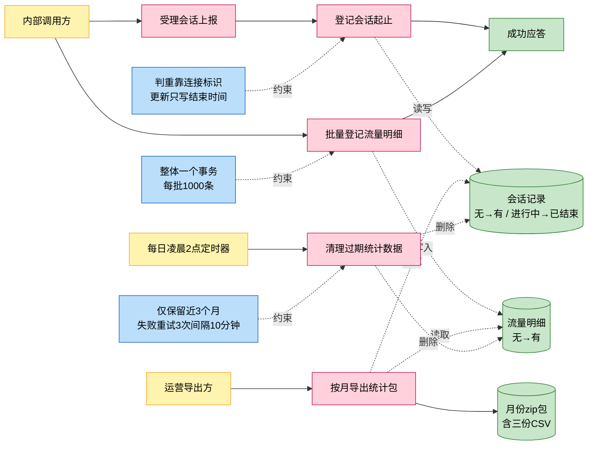
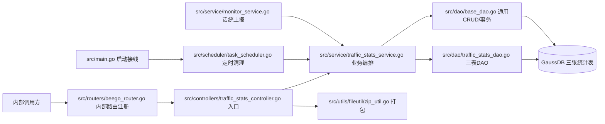
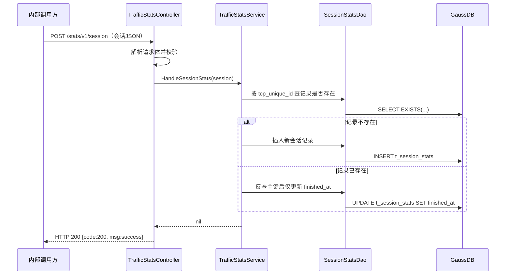
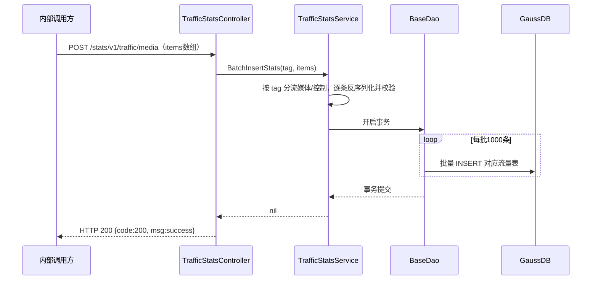
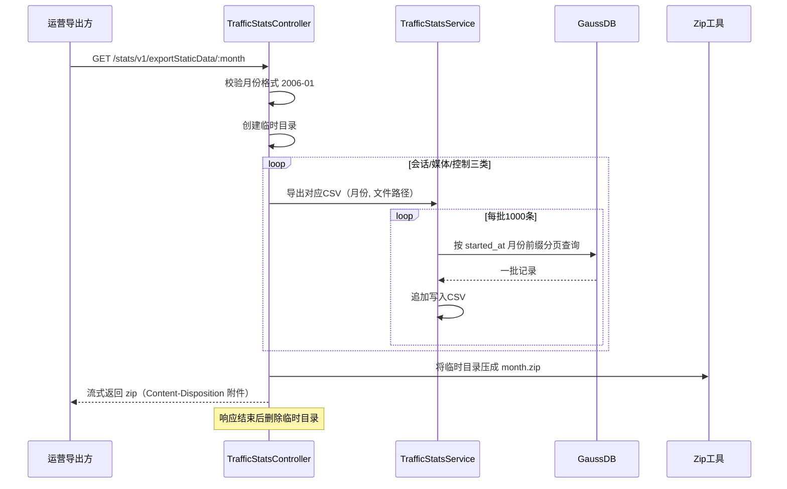
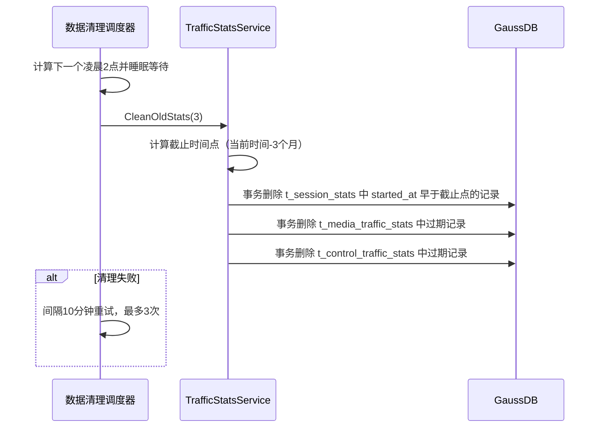

# 流量统计

> 功能域概述：接收内部组件上报的会话与流量数据落库，支持按月导出统计包，并定时清理过期数据。
> 接口数：5（内部 HTTP 4 / 定时任务 1）　核心模块：controllers, service, dao, scheduler

## 1. 功能故事（多彩建模）

实现逻辑速览（每句 ≤30 字）：

会话上报按连接标识判重，新则插入、旧则只更新结束时间。
流量明细整体一个事务分批落库，每批一千条。
导出按月份前缀分页查出三类数据，打包 zip 流式返回。
每日凌晨两点定时删除三个月前的全部统计数据。

术语表：

| 术语 | 人话解释 | 出处 |
|---|---|---|
| 会话统计 | 记录一次用户会话的开始与结束时间，一行一条会话 | src/models/db/traffic_stats.go |
| 媒体流量统计 | 按会话记录的媒体流下行字节数与接入方式 | src/models/db/traffic_stats.go |
| 控制流量统计 | 按会话记录的控制流下行字节数与接入方式 | src/models/db/traffic_stats.go |
| tcp_unique_id | TCP 连接唯一标识，会话记录判重与更新的依据 | src/dao/traffic_stats_dao.go |
| AppType | 应用类型编号（整型），业务枚举含义代码中未体现 | src/models/db/traffic_stats.go |
| AccessType | 接入方式编号（整型），业务枚举含义代码中未体现 | src/models/db/traffic_stats.go |
| GIDS | 本服务名，ServiceName=gids；全称含义代码中未体现 | src/common/constants/base.go |
| GaussDB | 本服务 ORM 连接的关系数据库，启动时建连 | src/main.go |
| CSP 话统监控 | 指标采集上报组件，复用本功能的统计查询做运营指标上报 | src/service/monitor_service.go |
| 内部路由 | 仅注册在内部 HTTP 监听上的接口，不对外部 HTTPS 开放 | src/routers/beego_router.go |

## 2. 模块划分

| 模块 | 承载功能（引用文件） |
|---|---|
| src/routers/beego_router.go | 将流量统计控制器注册到内部 HTTP 服务，外部路由不含本功能（src/routers/beego_router.go） |
| src/controllers/traffic_stats_controller.go | 4 条路由声明、请求解析、导出参数校验、CSV 导出编排、zip 流式响应（src/controllers/traffic_stats_controller.go） |
| src/service/traffic_stats_service.go | 会话插更、批量事务插入、按月分页导出 CSV、过期数据清理、面向话统的统计查询（src/service/traffic_stats_service.go） |
| src/dao/traffic_stats_dao.go | 三张统计表 DAO；按 tcp_unique_id 查存在、查主键、仅更新结束时间（src/dao/traffic_stats_dao.go） |
| src/dao/base_dao.go | 通用增删改查、原生 SQL 查询、事务包装、批量插入、查询条件构造（src/dao/base_dao.go） |
| src/models/db/traffic_stats.go | 三张表结构定义与 ORM 注册（src/models/db/traffic_stats.go） |
| src/scheduler/task_scheduler.go | 每日凌晨 2 点定时调度清理，失败重试 3 次、间隔 10 分钟，支持优雅停止（src/scheduler/task_scheduler.go） |
| src/utils/fileutil/zip_util.go | 将导出目录压成 zip 包（src/utils/fileutil/zip_util.go） |
| src/service/monitor_service.go | 消费方：复用统计查询接口上报在线数/流量话统指标，自身无对外接口（src/service/monitor_service.go） |

## 3. 接口清单

| 接口 | 路径/入口（含注册处） | 请求结构 | 响应结构 | 状态 |
|---|---|---|---|---|
| SessionStats | POST /stats/v1/session；入口 src/controllers/traffic_stats_controller.go；注册 src/routers/beego_router.go（仅内部路由） | SessionStats（src/models/db/traffic_stats.go）：{session_id, app_type, started_at, finished_at, tcp_unique_id} | BaseResponse（src/models/resp/base.go）：{code, msg}，成功 code=200 | 在用 |
| MediaTrafficStats | POST /stats/v1/traffic/media；入口 src/controllers/traffic_stats_controller.go；注册 src/routers/beego_router.go（仅内部路由） | MultiTableRequest（src/models/req/request_entity.go）：{items 非空数组}，元素为 MediaTrafficStats | BaseResponse（src/models/resp/base.go）：{code, msg} | 在用 |
| ControlTrafficStats | POST /stats/v1/traffic/control；入口 src/controllers/traffic_stats_controller.go；注册 src/routers/beego_router.go（仅内部路由） | MultiTableRequest（src/models/req/request_entity.go）：{items 非空数组}，元素为 ControlTrafficStats | BaseResponse（src/models/resp/base.go）：{code, msg} | 在用 |
| ExportStaticData | GET /stats/v1/exportStaticData/:month；入口 src/controllers/traffic_stats_controller.go；注册 src/routers/beego_router.go（仅内部路由） | 路径参数 month，格式 2006-01（src/controllers/traffic_stats_controller.go） | zip 文件流（session_stats.csv、media_stats.csv、control_stats.csv）；失败返回 BaseResponse | 在用 |
| 过期统计数据清理 | 每天凌晨 2:00（time.Timer 自研调度，非 cron 表达式）；入口 src/scheduler/task_scheduler.go；启动接线 src/main.go | 无入参；保留月数取常量 CleanupMonths=3（src/common/constants/base.go） | 无同步响应，仅日志；失败重试 3 次、间隔 10 分钟 | 在用 |

出向调用：无对外出向接口调用，仅访问本服务 GaussDB 三张统计表（src/dao/traffic_stats_dao.go、src/dao/base_dao.go）。

## 4. 关键数据结构

| 结构 | 定义位置 | 关键字段（含义+约束） |
|---|---|---|
| SessionStats（t_session_stats） | src/models/db/traffic_stats.go | ID（自增主键，json 不暴露）；SessionID（会话标识）；AppType（应用类型编号）；StartedAt/FinishedAt（起止时间，字符串，导出按 started_at 月份前缀过滤）；TcpUniqueId（TCP 连接唯一标识，判重键）；Validate 为空实现 |
| MediaTrafficStats（t_media_traffic_stats） | src/models/db/traffic_stats.go | ID（自增主键）；SessionID（关联会话）；AppType；StartedAt/FinishedAt；OutBytes（下行字节数 int64）；AccessType（接入方式编号）；Validate 为空实现 |
| ControlTrafficStats（t_control_traffic_stats） | src/models/db/traffic_stats.go | 字段同 MediaTrafficStats；FinishedAt/OutBytes 带 omitempty；Validate 为空实现 |
| MultiTableRequest | src/models/req/request_entity.go | Items（json.RawMessage 数组，必填且非空，元素逐条反序列化为对应统计表模型） |
| BaseResponse | src/models/resp/base.go | Code（200 成功 / -1 服务内部失败 / -2 客户端参数失败）；Msg（提示信息，json 键为 msg） |
| SQLConfig | src/service/traffic_stats_service.go | Queries（外置 SQL 配置，yaml 加载；仅供话统监控查询用，控制器侧传空路径不加载） |

## 5. 调用关系

链路一：会话上报（POST /stats/v1/session）：

链路二：流量明细批量上报（POST /stats/v1/traffic/media|control）：

链路三：按月导出统计包（GET /stats/v1/exportStaticData/:month）：

链路四：定时清理过期数据（每日凌晨 2:00）：

关键分支与异步环节（各一句，带证据文件）：

- 请求解析或处理失败返回 HTTP 400 + code=-1，导出参数非法返回 code=-2（src/controllers/controller.go、src/common/constants/retcode/retcode.go）
- 三张表模型的 Validate 均为空实现，批量插入不做字段级业务校验（src/models/db/traffic_stats.go）
- 会话更新只写 finished_at 一列，其余字段以首次插入为准（src/dao/traffic_stats_dao.go）
- 批量上报 tag 不支持时直接报错，媒体/控制走同一事务分批写入逻辑（src/service/traffic_stats_service.go）
- 导出响应结束后临时目录经 defer 整体删除，不落盘留存（src/controllers/traffic_stats_controller.go）
- 清理调度为独立协程，优雅退出经 GSF 退出回调停止（src/scheduler/task_scheduler.go、src/main.go）
- 话统监控复用统计查询接口（在线数/流量），控制器侧不加载外置 SQL 配置，查询配置为空时返回空结果（src/service/monitor_service.go、src/service/traffic_stats_service.go）
- 本功能无对外 HTTP/RPC 出向调用，链路不经过配置中心与缓存（src/service/traffic_stats_service.go）

## 6. 框架引用

| 基础框架 | 框架文档 | 本功能中的用途（引用文件） |
|---|---|---|
| Beego Web 路由/Controller | [rpc-beego-web.md](../framework-usage/rpc-beego-web.md) | 内部路由注册与四个接口的请求处理（src/routers/beego_router.go、src/controllers/traffic_stats_controller.go） |
| Beego ORM | [storage-beego-orm.md](../framework-usage/storage-beego-orm.md) | 三表增删改查、事务包装与批量插入（src/dao/base_dao.go、src/dao/traffic_stats_dao.go、src/models/db/traffic_stats.go） |
| JSON/YAML/CSV 序列化 | [codec-json-yaml.md](../framework-usage/codec-json-yaml.md) | 请求体解析、响应输出、外置 SQL 配置加载、CSV 导出（src/controllers/controller.go、src/service/traffic_stats_service.go） |
| 定时调度（time.Timer） | [schedule-timer.md](../framework-usage/schedule-timer.md) | 每日凌晨 2 点数据清理调度与优雅停止（src/scheduler/task_scheduler.go、src/main.go） |
| lager 日志 | [log-lager-auditlog-event.md](../framework-usage/log-lager-auditlog-event.md) | 上报、导出、清理全过程运行与失败日志（src/controllers/traffic_stats_controller.go、src/service/traffic_stats_service.go） |

## 7. AI 编码指南

- 新增统计接口只动 RouteInfo，自动注册到内部路由（src/controllers/traffic_stats_controller.go、src/routers/beego_router.go）
- 会话判重靠 tcp_unique_id，更新仅写 finished_at（src/dao/traffic_stats_dao.go）
- 批量写入走事务加每批1000，勿改单条插入（src/service/traffic_stats_service.go）
- 导出按 started_at 月份前缀过滤，月份格式 2006-01（src/service/traffic_stats_service.go、src/controllers/traffic_stats_controller.go）
- 清理周期改调度器，保留月数改 CleanupMonths（src/scheduler/task_scheduler.go、src/common/constants/base.go）
