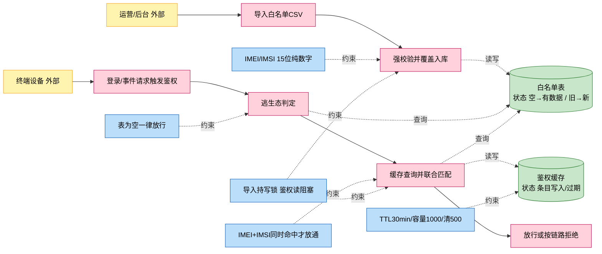
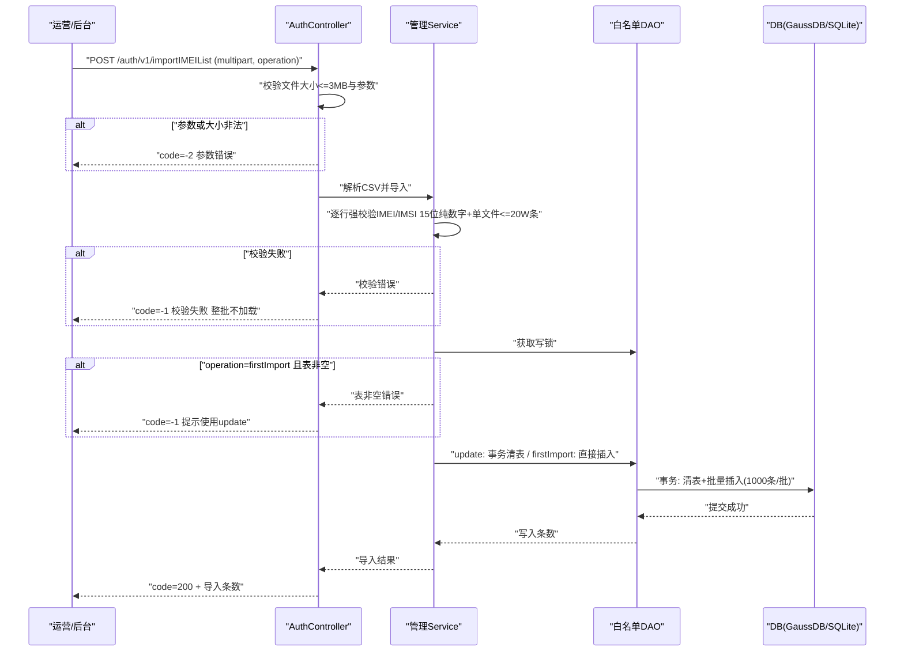
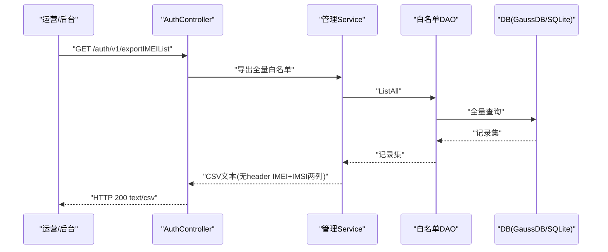
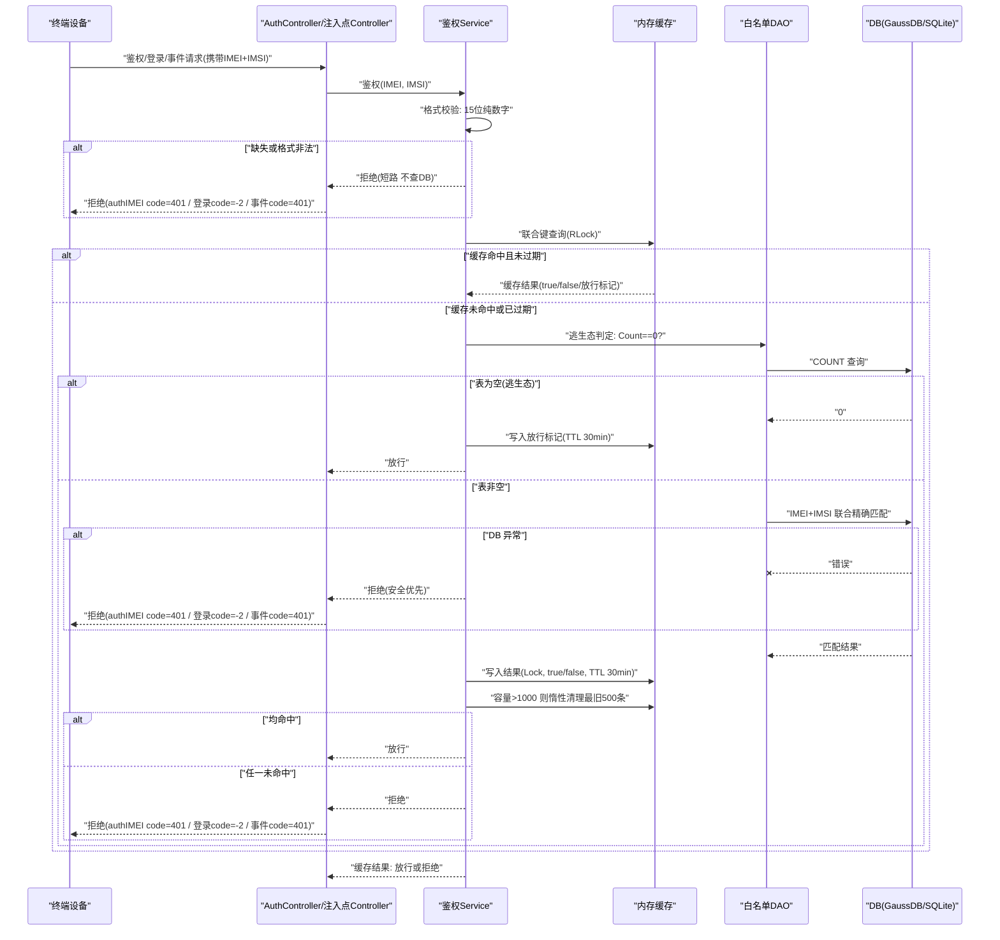
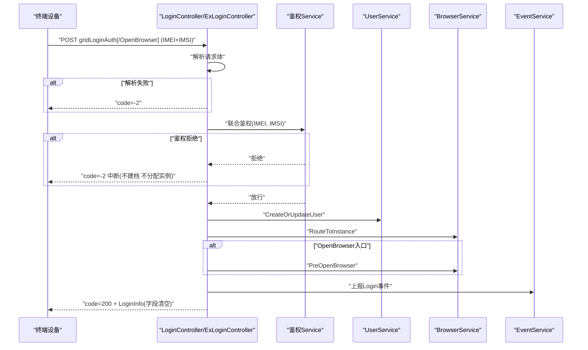
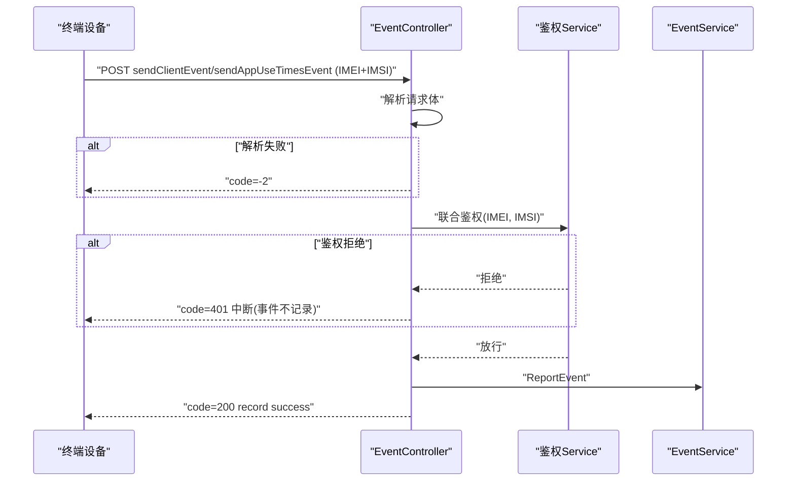
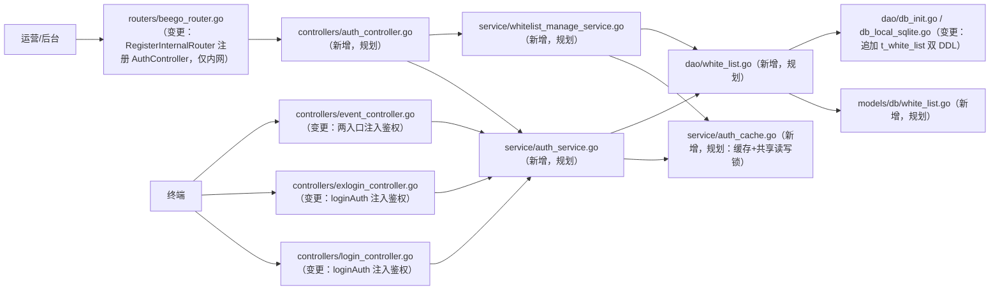

# 终端鉴权 Story

> 需求概述：云手机平台无终端准入校验，27.0 在 GIDS 补齐白名单 CSV 导入/导出与 IMEI+IMSI 联合鉴权（含逃生态与内存缓存），保障付费客户权益。
> 来源：docs/27.0/终端鉴权/27.0终端鉴权需求设计文档.md（下称"需求"）、docs/storys/终端鉴权-功能设计.md（下称"功能设计"，含 12 条审核裁定）　分支：new_skill_test（2026-08-11）

## 1. 需求概述（多彩建模）

实现逻辑速览（1~3 句，每句 ≤30 字，业务语言，禁文件名/函数名/行号）：

- 运营批量导入白名单，系统强校验后覆盖入库。
- 终端登录或上报事件，系统联合校验 IMEI+IMSI。
- 白名单为空一律放行；均命中放行，否则按链路拒绝。

术语表：

| 术语 | 人话解释 | 出处 |
| --- | --- | --- |
| IMEI | 国际设备移动标识，15 位纯数字，标识设备 | 需求 §8 |
| IMSI | 国际移动用户识别码，15 位纯数字，标识用户身份 | 需求 §8 |
| 联合鉴权 | IMEI 与 IMSI 同时精确命中白名单才放通的鉴权方式 | 需求 §8 |
| 逃生态 | 白名单未配置（表为空）时鉴权一律放行的保护机制 | 需求 §8 |
| 白名单 | 授权终端清单，每条记录为 IMEI+IMSI 精确匹配组合 | 需求 §8 |
| SBG_imei_list_inport_0X | 导入文件名约定，inport 为厂家既定拼写不修正，仅运营侧约定，服务端不校验 | 需求 §8、功能设计 D2 |
| GIDS | GlobalInstanceDeliverService，云浏览器全局实例交付服务 | 需求 §8 |
| authIMEI | 终端联合鉴权 REST 接口，统一 HTTP 200+body code 标识结果 | 需求 §2.2.3、§3 |
| firstImport / update | 导入模式：首次导入要求表空；update 事务清表覆盖 | 需求 §2.2.1 |

## 2. 核心要素变更总览

| 核心要素 | 变更类型 | 变更摘要 |
| --- | --- | --- |
| 对外接口 | 新增 | 新增 3 个仅内网接口：POST /auth/v1/authIMEI、POST /auth/v1/importIMEIList、GET /auth/v1/exportIMEIList；并对 4 个既有接口注入鉴权（见「变更」） |
| 业务规则 | 新增 | 新增导入校验、联合鉴权、逃生态、缓存与并发控制规则；变更登录链路与事件链路规则链，在参数解析后插入鉴权拒绝分支 |
| 数据模型 | 新增 | 新增 t_white_list 表（IMEI pk + IMSI，双 DDL）与进程内鉴权缓存结构 |
| 对象模型 | 新增 | 新增白名单实体（WhiteList）与鉴权缓存条目（cacheEntry），归属终端鉴权聚合 |
| 领域词典 | 新增 | 新增子域「终端鉴权（auth）」及术语：联合鉴权、逃生态、白名单、authIMEI、firstImport/update |
| 交互流程 | 新增 | 新增导入/导出/联合鉴权 3 条链路；变更 gridLoginAuth、gridLoginAuthOpenBrowser、sendClientEvent、sendAppUseTimesEvent 4 条既有链路插入鉴权环节 |
| 外部服务调用 | 不涉及 | 本需求无新增出向调用，无既有调用契约变更 |
| 技术要素 | 新增 | 进程内鉴权缓存（sync.RWMutex+map，TTL30min/容量1000/清500）、导入写锁并发控制、CSV 3MB/20W 硬限、双 DDL（GaussDB+SQLite） |

## 3. 对外接口

### 新增

| 接口 | 路径/入口（含注册处） | 请求结构 | 响应结构 | 状态 |
| --- | --- | --- | --- | --- |
| 终端联合鉴权 AuthIMEI | POST /auth/v1/authIMEI；入口 controllers/auth_controller.go（规划）；注册 routers/beego_router.go RegisterInternalRouter（变更） | JSON body：IMEI、IMSI 均必填（models/req 新增 AuthIMEIRequest，规划） | 统一 HTTP 200，body 为 resp.BaseResponse：code=200 放行 / code=401 拒绝（未命中；参数缺失或格式非法时 code=401、msg 含 "format invalid"——裁定 Q1）；链路差异码（-2/401）由注入点 Controller 转换，authIMEI 自身不区分链路（需求 §2.2.3） | 设计中 |
| 白名单导入 ImportIMEIList | POST /auth/v1/importIMEIList；入口 controllers/auth_controller.go（规划）；注册同上 | multipart/form-data：file（CSV，不校文件名）+ operation=firstImport/update；单文件 ≤3MB、≤20W 条 | body：code=200+导入条数 / code=-1 校验失败（整批不加载）/ code=-2 参数错误（需求 §2.2.1） | 设计中 |
| 白名单导出 ExportIMEIList | GET /auth/v1/exportIMEIList；入口 controllers/auth_controller.go（规划）；注册同上 | 无参数 | HTTP 200，Content-Type: text/csv，全量白名单 CSV（无 header，IMEI/IMSI 两列） | 设计中 |

> 三接口仅注册到 innerServer（127.0.0.1:9090，内网），不注册 externalServer；不做接口级认证，网络层隔离兜底（需求 §2.1、功能设计 G5）。

### 变更

| 既有接口 | 更改内容（变更前 → 变更后） | 更改位置 | 对调用方影响 |
| --- | --- | --- | --- |
| GridLoginAuth（POST /app-api/devicetcp/app/login/v1/gridLoginAuth） | 参数解析后直接建档路由 → 解析后先联合鉴权，拒绝返回 code=-2、msg 含 "auth rejected" 并中断，不再建档/分配实例 | controllers/login_controller.go、controllers/exlogin_controller.go 的 loginAuth() | 出入参契约不变，新增鉴权拒绝失败语义（body code=-2） |
| GridLoginAuthOpenBrowser（POST /app-api/devicetcp/app/login/v1/gridLoginAuthOpenBrowser） | 同上：解析后注入联合鉴权，拒绝中断 | 同上 loginAuth(true) 分支 | 同上 |
| DeviceLoginAuth（POST /app-api/devicetcp/app/login/v1/deviceLoginAuth） | 同上：共用 loginAuth() 注入点，自然一并覆盖（裁定 Q3） | 同上 loginAuth() | 同上 |
| SendClientEvent（POST /app-api/center/public/client/sendClientEvent） | 参数解析后直接落事件 → 解析后先联合鉴权，拒绝返回 code=401、msg 含 "auth rejected" 并中断，事件不记录 | controllers/event_controller.go SendClientEvent | 出入参契约不变，新增鉴权拒绝失败语义（body code=401） |
| SendAppUseTimesEvent（POST /app-api/center/public/client/sendAppUseTimesEvent） | 同上：解析后注入联合鉴权，拒绝中断 | controllers/event_controller.go SendAppUseTimesEvent | 同上 |

> 注入点取 IMEI/IMSI 自现有请求已携带字段（req.LoginAuthRequest.UserIdentity、req.ClientEventRequest、req.AppUseTimesEvent），无协议扩展（需求 §2.2.3、功能设计 G4）。loginAuth() 为 GridLoginAuth/GridLoginAuthOpenBrowser/DeviceLoginAuth 三入口共用函数，在 loginAuth() 注入即同位置覆盖三入口，DeviceLoginAuth 一并注入（裁定 Q3，对应 testsuit TC_005_003/004）。注入点拒绝 msg 统一含 "auth rejected"（裁定 Q2）。

## 4. 业务规则

### 新增

| 规则 | 条件 → 动作 | 依据（需求章节/规划代码位置） |
| --- | --- | --- |
| CSV 格式强校验 | 任一行 IMEI 或 IMSI 非 15 位纯数字（正则 ^[0-9]{15}$）→ 整批拒绝，一条不入库，返回 code=-1 | 需求 §2.2.1；service/whitelist_manage_service.go（规划） |
| CSV 解析口径 | 纯数据无 header 行、UTF-8 无 BOM、逗号分隔、兼容 CRLF/LF → 所有行当数据解析，空行跳过 | 需求 §2.2.1、功能设计 G3；service/whitelist_manage_service.go（规划） |
| 单文件规格硬限 | 文件 >3MB → code=-2 参数错误；解析条数 >20W → code=-1 整批拒绝；100W（5 文件）仅规格宣称不系统校验 | 需求 §2.2.1、功能设计 Q3；controllers/auth_controller.go（规划） |
| firstImport 幂等 | operation=firstImport 且白名单表非空 → 拒绝返回 code=-1，提示使用 update | 需求 §2.2.1；service/whitelist_manage_service.go（规划） |
| update 覆盖更新 | operation=update → 事务内清表+批量插入（1000 条/批），失败整批回滚 | 需求 §2.2.1、§4；dao/white_list.go（规划） |
| 导入并发控制 | 导入全程（含 update 清表+插入事务）持写锁 → 鉴权读阻塞至导入完成，杜绝清表窗口期逃生态误放行；并发导入写锁互斥 | 需求 §2.2.1、功能设计 G2；service/auth_cache.go（规划，共享读写锁） |
| 格式非法短路 | IMEI/IMSI 任一缺失或非 15 位纯数字 → 直接拒绝，不查缓存不查 DB；authIMEI 入口该场景返回 code=401、msg 含 "format invalid"（裁定 Q1） | 需求 §2.2.3、§4、testsuit TC_002.py；service/auth_service.go（规划） |
| 逃生态 | 白名单表 Count==0 → 一律放行，不阻断登录与事件上报主流程 | 需求 §2.2.3、§4；service/auth_service.go（规划） |
| 联合命中才放通 | IMEI 精确命中且 IMSI 精确命中（同一条白名单记录联合匹配）→ 放行；任一未命中 → 拒绝 | 需求 §2.2.3；service/auth_service.go（规划） |
| 缓存穿透防护 | 未命中的 IMEI+IMSI 组合 → 同样缓存 false 结果（TTL 30min），避免反复回源 DB | 需求 §2.2.4；service/auth_cache.go（规划） |
| DB 异常降级 | 缓存命中未过期 → 直接返回缓存结果；缓存未命中且 DB 异常 → 安全优先拒绝，不放行 | 需求 §2.2.4、功能设计 G1；service/auth_service.go（规划） |
| 缓存容量清理 | 写入后容量 >1000 → 按 expireAt 升序惰性清理最旧 500 条，清理与写入同一 Lock 内完成 | 需求 §2.2.4；service/auth_cache.go（规划） |
| 逃生态放行标记缓存 | 逃生态判定为放行 → 放行结果同样写入缓存（TTL 30min），避免每次请求都查 Count | 需求 §2.2.4；service/auth_service.go（规划） |
| 接口访问控制 | 三接口仅 innerServer 注册（内网可达）→ 不做接口级认证，网络层隔离兜底 | 需求 §2.1、§5、功能设计 G5；routers/beego_router.go（变更） |

### 变更

| 既有规则 | 变更前 → 变更后 | 位置 |
| --- | --- | --- |
| 登录链路执行顺序（rules-login.md「补充说明」：参数解析 → 用户建档 → 实例分配 → …） | 参数解析后直接建档 → 参数解析后先执行终端联合鉴权，拒绝则中断返回 code=-2、msg 含 "auth rejected"（裁定 Q2），不再建档/分配实例/上报事件；通过才进入原有建档与路由 | controllers/login_controller.go、controllers/exlogin_controller.go 的 loginAuth() |
| 事件链路执行顺序（rules-event.md：参数解析 → 落事件存储） | 参数解析后直接落事件 → 参数解析后先执行终端联合鉴权，拒绝则中断返回 code=401、msg 含 "auth rejected"（裁定 Q2），事件不记录；通过才落事件 | controllers/event_controller.go SendClientEvent / SendAppUseTimesEvent |

## 5. 数据模型

### 新增

| 结构/表 | 关键字段（含义+约束+索引） | 生命周期 |
| --- | --- | --- |
| t_white_list | imei char(15) 设备标识，PRIMARY KEY（Beego 不支持复合 pk，IMEI 设 pk）；imsi char(15) 用户身份标识，NOT NULL，DDL UNIQUE INDEX 兜底（替代复合唯一约束）；created_at 入库时间 | 导入写入：firstImport 空表插入 / update 事务清表+批量插入（1000 条/批）覆盖整表；导出只读；TTL 无（静态白名单） |
| 鉴权缓存（进程内，内存态） | map[string]cacheEntry：键=IMEI+IMSI 联合键；值=result（true/false/逃生态放行标记）+expireAt；sync.RWMutex 保护；容量上限 1000，超限按 expireAt 升序清最旧 500；TTL 30min | 随进程生命周期；条目自然失效回源 DB；白名单更新后最长 30min 反映最新（不提供主动刷新，急需可重启服务） |

> 双 DDL：GaussDB 建表语句追加至 dao/db_init.go 的 initSql；SQLite 等价语句追加至 dao/db_local_sqlite.go 的 localSqliteInitSql，保证两套表结构一致（需求 §6）。

## 6. 对象模型

### 新增

| 对象 | 关键属性与关联 | 说明 |
| --- | --- | --- |
| WhiteList（实体，终端鉴权聚合根） | Imei（pk）、Imsi、CreatedAt | 对应 t_white_list；models/db/white_list.go（规划），orm 标签 + TableName() + init 注册 |
| cacheEntry（值对象） | result（命中/未命中/逃生态放行）、expireAt | 鉴权缓存条目，仅存于鉴权缓存组件内；service/auth_cache.go（规划） |

## 7. 领域词典

| 术语 | 释义 | 变更类型（新增/释义演进） | 落入子域 | 代码命名映射（规划） |
| --- | --- | --- | --- | --- |
| 联合鉴权 | IMEI 与 IMSI 同时精确命中白名单才放通的鉴权方式 | 新增 | 终端鉴权（auth，新子域） | AuthService.AuthIMEI，service/auth_service.go（规划） |
| 逃生态 | 白名单表为空时鉴权一律放行的保护机制 | 新增 | 终端鉴权（auth） | Count==0 分支，service/auth_service.go（规划） |
| 白名单 | 授权终端清单，每条记录为 IMEI+IMSI 精确匹配组合（不使用"用户列表"） | 新增 | 终端鉴权（auth） | db.WhiteList / dao.WhiteListDao，models/db/white_list.go、dao/white_list.go（规划） |
| authIMEI | 终端联合鉴权 REST 接口，统一 HTTP 200+body code 标识结果，不区分链路 | 新增 | 终端鉴权（auth） | AuthController.AuthIMEI，controllers/auth_controller.go（规划） |
| firstImport / update | 导入模式：首次导入要求表空 / 事务清表覆盖更新 | 新增 | 终端鉴权（auth） | operation 表单参数取值，service/whitelist_manage_service.go（规划） |

## 8. 交互流程

### 新增链路

**链路 1：白名单导入**

实现说明（每句 ≤30 字）：

- 入口校验文件大小与 operation 参数，非法即参数错误返回。
- 逐行按无 header 口径解析 CSV，跳过空行。
- 每行 IMEI/IMSI 强校验 15 位纯数字，任一行失败整批拒绝。
- 导入全程持写锁，鉴权读阻塞至导入完成。
- firstImport 要求表为空，update 在事务内清表后批量插入。
- 成功返回导入条数，失败整批不落库。

**链路 2：白名单导出**

实现说明：

- 导出为只读链路，不修改白名单数据。
- 按导入同口径生成 CSV：无 header、IMEI/IMSI 两列。
- 响应 Content-Type 为 text/csv。

**链路 3：终端联合鉴权（authIMEI 与注入点共用）**

实现说明：

- 格式非法直接拒绝，不查缓存不查库。
- 联合键先查缓存，命中未过期直接返回。
- 缓存未命中先判逃生态，表空一律放行并缓存放行标记。
- 表非空执行联合精确匹配，结果写缓存。
- 缓存未命中且 DB 异常时安全优先拒绝。
- 链路差异码由注入点转换，鉴权服务只返回放行/拒绝。

### 变更链路

| 链路 | 变更点（在哪个环节插入/替换/删除什么） |
| --- | --- |
| 网格登录 gridLoginAuth（interaction-model-grid-login-auth.md） | 在「参数解析」与「用户建档 CreateOrUpdateUser」之间插入联合鉴权环节，拒绝则中断返回 code=-2，后续建档/实例分配/事件上报均不执行 |
| 预开浏览器登录 gridLoginAuthOpenBrowser（interaction-model-grid-login-auth-open-browser.md） | 同上，共用 loginAuth() 注入点；拒绝则不触发预开浏览器 |
| 客户端事件上报 sendClientEvent（interaction-model-send-client-event.md） | 在「参数解析」与「ReportEvent 落事件」之间插入联合鉴权环节，拒绝则中断返回 code=401，事件不记录 |
| 应用使用时长上报 sendAppUseTimesEvent（interaction-model-send-app-use-times-event.md） | 同上 |

变更后登录主链路：

变更后事件主链路：

## 10. 技术要素

| 技术要素（并发/数据访问/韧性/日志配置告警） | 变更类型 | 内容 | 位置 |
| --- | --- | --- | --- |
| 鉴权缓存（并发） | 新增 | 进程内 sync.RWMutex + map[string]cacheEntry；读 RLock、写/清理 Lock；容量 1000、超限惰性清最旧 500、TTL 30min；无独立清理 goroutine | service/auth_cache.go（规划） |
| 导入并发控制（并发） | 新增 | 导入管理 Service 与鉴权 Service 共享一把读写锁：导入全程（含 update 事务）持写锁，鉴权 DB 回源段持读锁，杜绝清表窗口期逃生态误放行 | service/auth_cache.go（规划，锁定义） |
| 数据访问 | 新增 | 白名单 DAO 继承 BaseInterface，EntityType=db.WhiteList；事务清表+批量插入用 DoTxWithCtx；批量插入 1000 条/批；双 DDL（GaussDB initSql + SQLite localSqliteInitSql） | dao/white_list.go、dao/db_init.go、dao/db_local_sqlite.go（均为规划/变更） |
| 韧性 | 新增 | 逃生态放行、格式非法短路、缓存穿透防护（false 也缓存）、缓存未命中+DB 异常安全优先拒绝、导入事务失败整批回滚 | service/auth_service.go、service/whitelist_manage_service.go（规划） |
| 日志 | 新增 | 鉴权拒绝/导入失败等关键分支按存量 logger 封装记录错误日志，IMEI/IMSI 参照存量 desensitize 惯例按需脱敏 | service/auth_service.go（规划）；参照 src/service/user_service.go |
| 配置/告警 | 不涉及 | 无新增配置项与告警 ID | - |

## 11. 实现方案与修改清单

Story 划分与依赖（需求 §2.3）：Story-1 白名单数据基础设施 → Story-2 管理接口（依赖 1）→ Story-3 联合鉴权核心服务（依赖 1）→ Story-4 登录链路注入（依赖 3）→ Story-5 事件链路注入（依赖 3）。

| 模块 | 变更类型 | 承载功能与更改内容 |
| --- | --- | --- |
| models/db/white_list.go | 新增（规划） | WhiteList 实体：Imei pk、Imsi、CreatedAt；TableName()+init 注册（Story-1） |
| dao/white_list.go | 新增（规划） | WhiteListDao 继承 BaseInterface：Count/GetByIMEIAndIMSI/InsertMulti/ClearAndInsert（DoTxWithCtx）/ListAll（Story-1） |
| dao/db_init.go | 变更 | initSql 追加 t_white_list 建表语句 + IMSI UNIQUE INDEX（GaussDB DDL，Story-1） |
| dao/db_local_sqlite.go | 变更 | localSqliteInitSql 追加 SQLite 等价建表与索引（Story-1） |
| service/whitelist_manage_service.go | 新增（规划） | 管理 Service：CSV 解析强校验、firstImport/update 导入（持写锁）、导出生成（Story-2） |
| controllers/auth_controller.go | 新增（规划） | 三接口 HTTP 入口：AuthIMEI/ImportIMEIList/ExportIMEIList，不做业务逻辑（Story-2/3） |
| models/req/auth_request.go | 新增（规划） | AuthIMEIRequest（IMEI/IMSI 必填+Validate）（Story-3） |
| service/auth_service.go | 新增（规划） | 鉴权 Service：格式校验+逃生态+缓存查询+联合匹配，DB 异常安全优先拒绝（Story-3） |
| service/auth_cache.go | 新增（规划） | 缓存组件：RWMutex+map、TTL/容量/惰性清理、导入共享读写锁（Story-3） |
| routers/beego_router.go | 变更 | RegisterInternalRouter 注册 AuthController（仅内网，三接口）（Story-2/3） |
| controllers/login_controller.go | 变更 | loginAuth() 参数解析后注入联合鉴权，拒绝返回 code=-2 中断（Story-4） |
| controllers/exlogin_controller.go | 变更 | 同上（Story-4） |
| controllers/event_controller.go | 变更 | SendClientEvent/SendAppUseTimesEvent 参数解析后注入联合鉴权，拒绝返回 code=401 中断（Story-5） |
| models/resp/response_entity.go | 复用 | 统一响应信封 BaseResponse/DataResponse |
| common/constants/retcode/retcode.go | 复用 | retcode.Success/ClientFailed/InternalFailed/AuthFailed |
| service/auth_service.go 依赖的 dao.WhiteListDao | 复用 Story-1 产物 | 鉴权回源查询 |

正交四原则自检：DRY——鉴权逻辑唯一实现于 AuthService，authIMEI 与 4 个注入点复用同一服务，链路码转换留在各 Controller（不复制鉴权逻辑）；CSV 解析/校验唯一实现于管理 Service。SoC——Controller 只做协议与码转换，鉴权决策在 Service，DB 在 DAO，缓存在独立组件，符合需求 §2.4 模块职责约束。最小化依赖——缓存用 Go 标准库 sync，不引第三方；新接口仅内网注册不触碰 externalServer。稳定依赖方向——routers→controllers→service→dao→models 单向，缓存组件被两个 Service 持有不反向依赖，无循环依赖。

## 12. 外部文档引用

| 文档类型 | 引用文档 | 引用点 |
| --- | --- | --- |
| 接口文档 | [interface-login.md](../biz/interface/interface-login.md) | 登录链路注入点（GridLoginAuth/GridLoginAuthOpenBrowser 双 Controller）与请求模型 UserIdentity（IMEI/IMSI）对照基线 |
| 接口文档 | [interface-event.md](../biz/interface/interface-event.md) | 事件链路注入点（SendClientEvent/SendAppUseTimesEvent）与请求模型 IMEI/IMSI 字段对照基线 |
| 外部接口文档 | 无引用 | 本需求无出向调用（对外接口三态判定为不涉及） |
| 基础框架文档 | [usage-beego.md](../tech/usage/usage-beego.md) | 按该文档路由注册约定执行：Controller 实现 RouteInfo()，RegisterInternalRouter 统一注册 |
| 基础框架文档 | [usage-beego-orm.md](../tech/usage/usage-beego-orm.md) | 按该文档约定执行：实体 orm 标签+TableName+init 注册、DAO 继承 BaseDao、事务 DoTxWithCtx、手写双 DDL（不走 RunSyncdb）、Beego 不支持复合 pk 以 UNIQUE INDEX 兜底 |
| 基础框架文档 | [usage-go-testing.md](../tech/usage/usage-go-testing.md) | DT 测试按仓内存量 Go 单测约定搭建（service/dao/controllers 同目录 _test.go） |
| 结构模型文档 | [structure-model.md](../arch/structure-model/structure-model.md) | 新模块分层归属依据（routers→controllers→service→dao→models 单向分层） |
| 既有 story | 无引用 | docs/storys/ 下无被注入功能的既有 story 文档（被注入链路原始设计见交互模型与规则资产） |
| 其它资产 | [rules-login.md](../biz/rules/rules-login.md) | 登录链路规则变更前基线（执行顺序、错误码语义） |
| 其它资产 | [rules-event.md](../biz/rules/rules-event.md) | 事件链路规则变更前基线 |
| 其它资产 | [interaction-model-grid-login-auth.md](../arch/interaction-model/interaction-model-grid-login-auth.md)、[interaction-model-send-client-event.md](../arch/interaction-model/interaction-model-send-client-event.md) | 被注入链路变更前主链路基线 |
| 其它资产 | [lexicon.md](../biz/lexicon/lexicon.md) | 词典子域口径参照（新子域 auth 锚点与功能域一致） |
