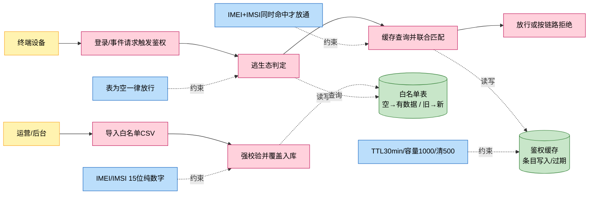
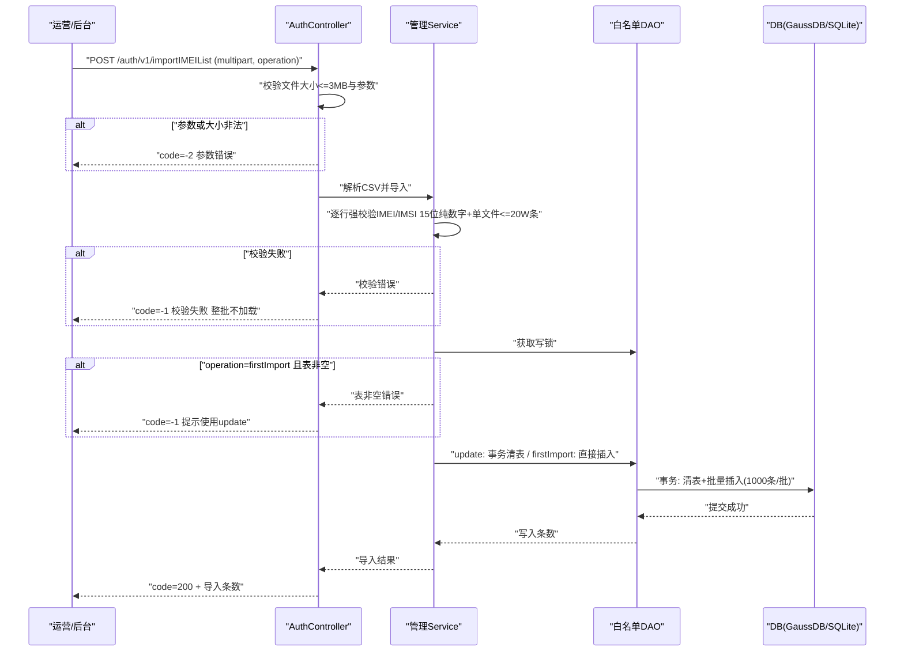
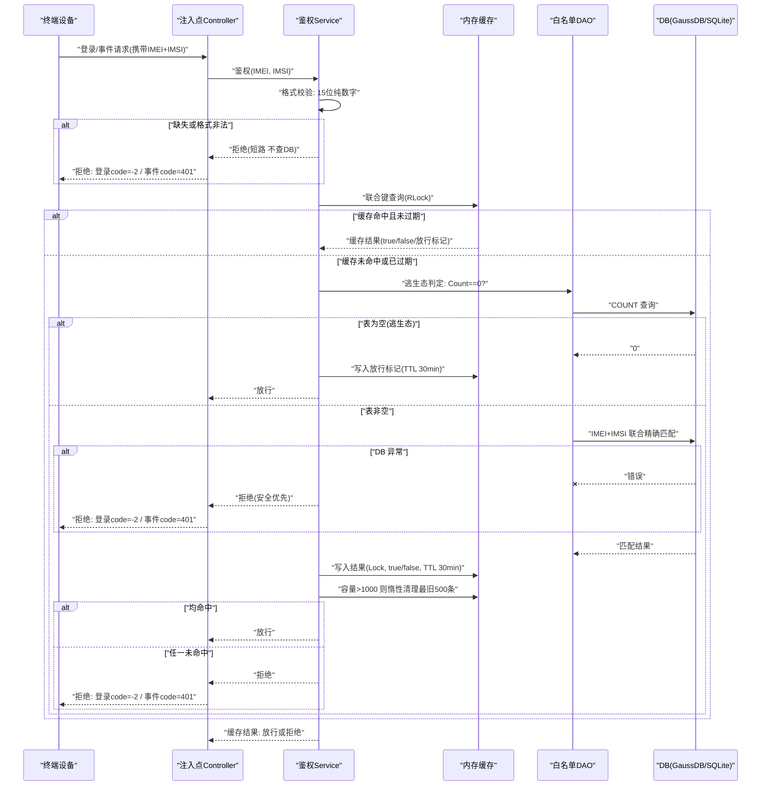

# 功能设计

> 本文档由 spec-audit 场景 1 审核后生成，内容来源 =《27.0 终端鉴权需求设计文档》+ 12 条断点人工裁定（2026-08-11）。审核建模结果见 `docs/audit/终端鉴权/终端鉴权-建模结果.html`。

## 1 功能编号：27.0 终端鉴权功能实现（新增）

### 1.1 功能概述

云手机平台当前无终端准入校验，任何终端可直接登录接入云手机实例。27.0 版本在 GIDS（GlobalInstanceDeliverService，云浏览器全局实例交付服务）上补齐商用终端鉴权能力：运营通过 REST 接口批量导入/导出白名单（CSV，IMEI+IMSI 两列），终端登录与事件上报链路注入 IMEI+IMSI 联合鉴权（两者必须同时精确命中才放通）；白名单未配置（表为空）时进入逃生态一律放行，避免线上阻断；鉴权结果经内存缓存降低 DB 访问并提供短时降级能力。

### 1.2 多彩建模

业务故事速览：

- 运营批量导入白名单，系统强校验后覆盖入库。
- 终端登录或上报事件，系统联合校验 IMEI+IMSI。
- 白名单为空一律放行；均命中放行，否则拒绝。

四色建模图：

术语表：

| 术语 | 人话解释 | 出处 |
| --- | --- | --- |
| IMEI | 国际设备移动标识，15 位数字，标识设备 | 需求文档 §8 |
| IMSI | 国际移动用户识别码，15 位纯数字，标识用户身份 | 需求文档 §8 |
| 联合鉴权 | IMEI 与 IMSI 同时命中白名单才放通的鉴权方式 | 需求文档 §8 |
| GIDS | GlobalInstanceDeliverService，云浏览器全局实例交付服务 | 需求文档 §8 |
| 逃生态 | 白名单未配置（表为空）时鉴权一律放行的保护机制 | 需求文档 §8 |
| 白名单 | 授权终端清单，每条记录为 IMEI+IMSI 精确匹配组合（全文统一术语） | 需求文档 §8（人工补齐 Q2） |
| SBG_imei_list_inport_0X | 导入文件名约定，inport 为厂家既定拼写不修正，仅运营侧约定 | 需求文档 §8（人工补齐 Q2/D2） |

### 1.3 SR 设计

| 系统需求编号 | 系统需求 | 系统需求描述 |
| --- | --- | --- |
| SR-27.0-AUTH-01 | 白名单数据模型与持久化（IMEI+IMSI） | 白名单表建模 + DAO（承载 Story-1，P0） |
| SR-27.0-AUTH-02 | 白名单管理（CSV 导入/导出） | 管理 Service + Controller（承载 Story-2，P0） |
| SR-27.0-AUTH-03 | IMEI+IMSI 联合鉴权核心服务 | 鉴权 Service + 缓存 + 逃生态（承载 Story-3，P0） |
| SR-27.0-AUTH-04 | 登录链路鉴权注入 | LoginController + ExLoginController（承载 Story-4，P0） |
| SR-27.0-AUTH-05 | 事件上报链路鉴权注入 | EventController（承载 Story-5，P0） |

安全 SPEI 实例关联：不涉及（需求文档 §1.6 威胁建模标记"不涉及"，接口访问控制裁定见 1.5/1.7，人工补齐 G5）。

### 1.4 实现设计

功能分解到 GIDS 现有分层（Controller / 鉴权 Service / 管理 Service / 缓存组件 / DAO / Model），职责约束见需求文档 §2.4。关键机制：

- **导入并发控制**：导入全程（含 update 清表+插入事务）持写锁，鉴权读阻塞至导入完成；并发导入由写锁互斥（人工补齐 G2）。
- **DB 异常降级**：缓存命中且未过期时 DB 不可用不影响鉴权；缓存未命中 + DB 异常时安全优先**拒绝**（人工补齐 G1）。
- **CSV 解析口径（强约束）**：纯数据无 header、UTF-8 无 BOM、逗号分隔、兼容 CRLF/LF、跳过空行（人工补齐 G3）。
- **规格**：单文件≤3MB、20W 条硬限（超限整批拒绝）、批量插入 1000 条/批；100W（5 文件）仅规格宣称不系统校验，DB 规格待实测（人工补齐 Q3）。
- **取数来源**：现有登录/事件请求已携带 IMEI+IMSI 字段，直接取用，无需协议扩展（人工补齐 G4）。

#### 1.4.1 白名单导入用例设计-时序图

用例编号：UC-AUTH-IMPORT-01

说明：导入期间写锁全程持有，鉴权读阻塞，杜绝清表窗口期逃生态误放行（G2）；文件名校验不做，仅运营侧约定（D2/Q1）。

#### 1.4.2 终端联合鉴权用例设计-时序图

用例编号：UC-AUTH-CHECK-01（登录链路与事件上报链路共用）

说明：链路差异码（登录 -2 / 事件 401）由注入点 Controller 转换，鉴权 Service 与 authIMEI 不区分链路（D1）；缓存 miss + DB 异常按安全优先拒绝（G1）。

#### 1.4.3 白名单导出用例设计-自然语言描述（可选）

用例编号：UC-AUTH-EXPORT-01

前置条件：运营/后台位于内网，GIDS 服务可达（端口 9090）。

触发事件：运营 GET `/auth/v1/exportIMEIList`。

主流程描述：

- 步骤1：Controller 接收导出请求，透传至管理 Service；
- 步骤2：管理 Service 经 DAO 查询全量白名单记录；
- 步骤3：按 CSV 口径（无 header、IMEI+IMSI 两列）生成 CSV 文本；
- 步骤4：返回 CSV 文件内容给运营。

后置条件：白名单数据不变，仅只读导出。

### 1.5 用户接口设计

本功能新增 3 个对外 REST 接口（仅内网可达，不做接口级认证，网络层隔离兜底——人工补齐 G5；权限数字化对象定义：待确认）：

| 接口 | 方法 | 路径 | 说明 |
| --- | --- | --- | --- |
| 终端联合鉴权 | POST | `/auth/v1/authIMEI` | 校验 IMEI+IMSI 是否同时命中白名单；统一返回 HTTP 200，body 携带 code 字段标识结果，链路差异码（-2/401）由注入点 Controller 转换 |
| 白名单导入 | POST | `/auth/v1/importIMEIList` | multipart/form-data 上传 CSV（无 header，IMEI/IMSI 两列），参数 operation=firstImport/update |
| 白名单导出 | GET | `/auth/v1/exportIMEIList` | 下载全量白名单为 CSV（无 header，IMEI/IMSI 两列） |

鉴权注入点（非新增接口，在现有链路注入）：`gridLoginAuth`、`gridLoginAuthOpenBrowser`、`sendClientEvent`、`sendAppUseTimesEvent`；IMEI/IMSI 取自现有请求已携带字段，无协议变更。

前提条件与约束：导入 firstImport 要求白名单表为空；update 为覆盖更新；单文件≤3MB、≤20W 条；导入期间鉴权读阻塞。

### 1.6 实现接口设计

#### 1.6.1 接口设计

系统元素间接口（DAO/Service 层，接口注入便于单测 mock，具体方法签名由 Story 详设定）：

| | |
| --- | --- |
| 接口名称 | 白名单 DAO 接口 |
| 接口描述 | 白名单表读写：Count / GetByIMEI / InsertMulti / ClearAndInsert / ListAll |
| 接口类型 | 内部 Go 接口 |
| 所属系统元素 | GIDS DAO 层 |
| 归属的逻辑接口名 | 待确认 |
| Input要求/参数（可选） | IMEI+IMSI 记录集（InsertMulti 批次 1000 条/批） |
| Output要求/参数（可选） | 记录数 / 匹配结果 / 错误 |
| 规格、约束和注意事项 | 清表+插入须在同一事务；Beego 不支持复合 pk，IMEI 设 pk、IMSI 用 UNIQUE INDEX 兜底 |
| 版本变化 | 27.0 新增 |

| | |
| --- | --- |
| 接口名称 | 鉴权 Service 接口 |
| 接口描述 | 鉴权决策：格式校验 + 逃生态判定 + 缓存查询 + IMEI/IMSI 精确匹配 |
| 接口类型 | 内部 Go 接口 |
| 所属系统元素 | GIDS Service 层 |
| 归属的逻辑接口名 | 待确认 |
| Input要求/参数（可选） | IMEI、IMSI（原始字符串，Service 内做 15 位纯数字校验） |
| Output要求/参数（可选） | 放行/拒绝（布尔结果，链路码由调用方转换） |
| 规格、约束和注意事项 | DB 异常且缓存 miss 时返回拒绝（安全优先）；不做 CSV 解析、不做 HTTP 响应 |
| 版本变化 | 27.0 新增 |

#### 1.6.2 接口权限设计（可选）

不涉及（三接口仅内网可达，不做接口级认证，由网络层隔离兜底——人工裁定 G5）。

### 1.7 安全配置设计

- 导入文件强校验：IMEI/IMSI 严格 15 位纯数字，单文件≤3MB。
- 双因子防伪：IMEI 标识设备、IMSI 标识用户身份，联合鉴权防单一标识伪造。
- 隐私：白名单仅存储 IMEI/IMSI，不存储用户个人敏感信息。
- 接口访问控制：仅内网可达，不做认证（人工裁定 G5）。

### 1.8 功能规格

- 白名单表支持 100W 静态用户（每条 IMEI+IMSI 精确匹配组合；DB 规格能否支撑待实测）。
- 单文件导入≤20W 条（硬限）、≤3MB；批量插入 1000 条/批。
- 缓存容量 1000、惰性清理最旧 500、TTL 30min。
- 单点鉴权接口响应满足现有登录链路时延要求（内存缓存降低 DB 访问频次）。

### 1.9 DFX 分析

- **可靠性/逃生态**：表 Count==0 一律放行；导入事务性（校验失败整批不加载）；联合鉴权短路（格式非法不查 DB）。
- **可测试性**：DAO 与 Service 层接口注入便于 mock；LOCAL_MODE=true 触发 SQLite 支持本地集成测试。
- **可维护性**：遵循 GIDS 现有分层；双 DDL（GaussDB + SQLite）保证表结构一致。
- 告警、性能指标数字化对象：待确认。

### 1.10 分配需求

| 需求项 | 承载 Story | 优先级 |
| --- | --- | --- |
| 白名单数据模型与持久化（IMEI+IMSI） | Story-1 | P0 |
| 白名单管理（CSV 导入/导出） | Story-2 | P0 |
| IMEI+IMSI 联合鉴权核心服务 | Story-3 | P0 |
| 登录链路鉴权注入 | Story-4 | P0 |
| 事件上报链路鉴权注入 | Story-5 | P0 |

功能验收用例：下放 Story 详设阶段补齐（人工裁定 D3）。
