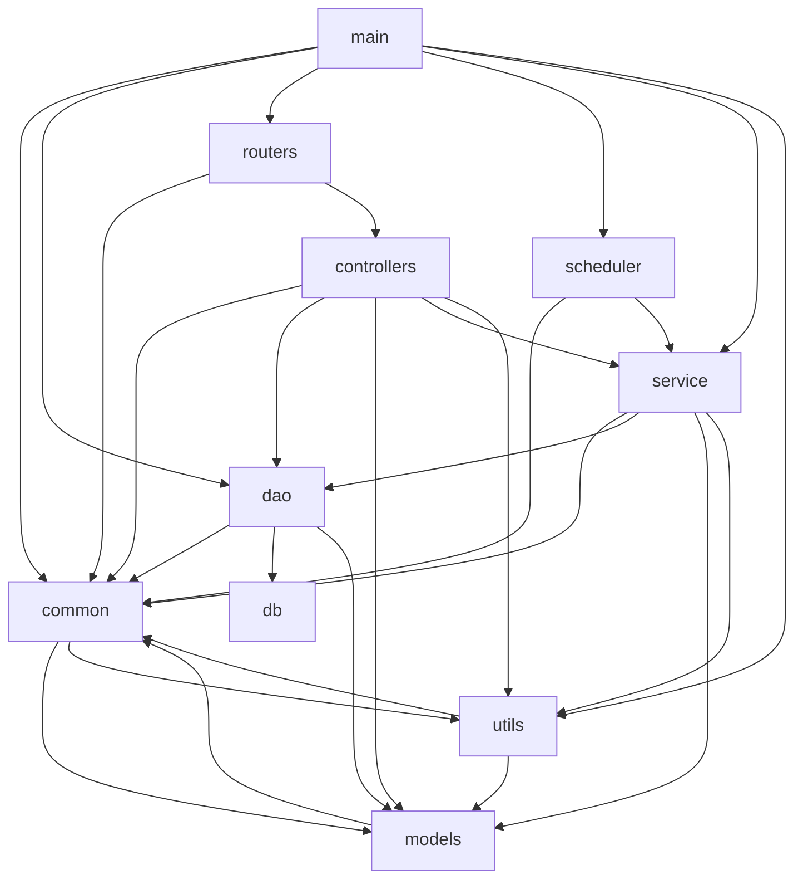

# AIAction 结构文档

> 生成时间：2026-07-29
> 分析模式：仓库级
> 输入路径：/home/lele/project/work/csp-ysj/AIAction

## 概览

- 语言：Go
- 构建工具：Go module（`src/go.mod`，module 名 `GIDS`，go 1.25.0）
- 源码根：`src`（go.mod 所在目录）
- 模块数：10（含 `main` 入口）

### 业务目录识别依据

仓库根第一层业务代码仅 `src/`（`build/`、`docs/`、`.claude/`、`.git/` 为辅助/元目录，`testsuit/` 为 Python E2E 测试），故下沉至源码根 `src/` 取其第一层目录分析。`src/` 下排除：`conf`（配置文件目录）、`test`（测试工具）、`stubs`（go.mod replace 指向的空实现桩，辅助）。剩余 `common`、`controllers`、`dao`、`db`、`models`、`routers`、`scheduler`、`service`、`utils` 为业务模块；`src/main.go` 为启动入口单列为 `main` 节点。

## 模块关系图

## 模块说明

| 模块 | 路径 | 职责 | 主要依赖 | 被依赖 |
| --- | --- | --- | --- | --- |
| main | src/main.go | 程序启动入口（package main），负责配置加载、数据库/ORM 初始化、路由注册、调度器启动与服务单例初始化。 | common, dao, routers, scheduler, service, utils | - |
| controllers | src/controllers | Beego Controller 层，接收 HTTP 请求并转调 service，覆盖 login、event、file、plugin、cache、traffic_stats、management、config_center 等业务接口。 | common, dao, models, service, utils | routers |
| service | src/service | 业务服务层（接口+小写实现类+sync.Once 单例），封装核心业务逻辑，被 controllers 调用，落地 dao 与 models。 | common, dao, models, utils | main, controllers, scheduler |
| dao | src/dao | DAO 数据访问层（继承 BaseInterface，设置 EntityType），操作 Beego ORM，提供 SQLite 本地模式与 GaussDB 链路，通过 db/driver 注册驱动。 | common, db, models | main, controllers, service |
| db | src/db | 数据库驱动相关，含 db/driver 驱动抽象，提供数据库驱动注册入口（由 dao 的 db_init 以空白导入 `_` 方式引入）。 | - | dao |
| models | src/models | 数据实体与传输对象，含 db（ORM 实体+TableName+init 注册）、req 请求体、resp 响应体、events 事件模型、browsergateway 浏览器网关模型、monitor 监控指标。 | common | controllers, service, dao, common, utils |
| routers | src/routers | Beego 路由注册层，将 URL 路径绑定到 controllers。 | common, controllers | main |
| scheduler | src/scheduler | 定时任务调度器，周期触发 service 执行。 | common, service | main |
| common | src/common | 公共工具与基础能力库，含 cert 证书、conf 配置加载、constants/retcode 返回码、cse 服务发现、event 事件存储、https HTTP 请求 builder、logger 日志、storage(redis/oss) 存储客户端。 | models, utils | main, controllers, service, dao, routers, scheduler, models, utils |
| utils | src/utils | 辅助函数库，含 flagutil 命令行参数、fileutil 文件/压缩工具、monitorutil 监控工具、response 响应封装。 | common, models | main, controllers, service, common |

### 依赖关系说明

- `common` 与 `models`、`common` 与 `utils` 存在双向依赖（各自互 import 对方子包），图中以两条独立箭头表示，未合并为双向边。
- `db` 为叶子模块，仅被 `dao` 依赖，无对外业务依赖。
- `main` 汇聚启动链路，直接依赖配置/DAO/路由/调度/服务五类入口模块。
- 依赖结论均由各模块 `.go` 文件中 `GIDS/...` import 语句实证，证据为对应源文件路径，不附代码行号。
