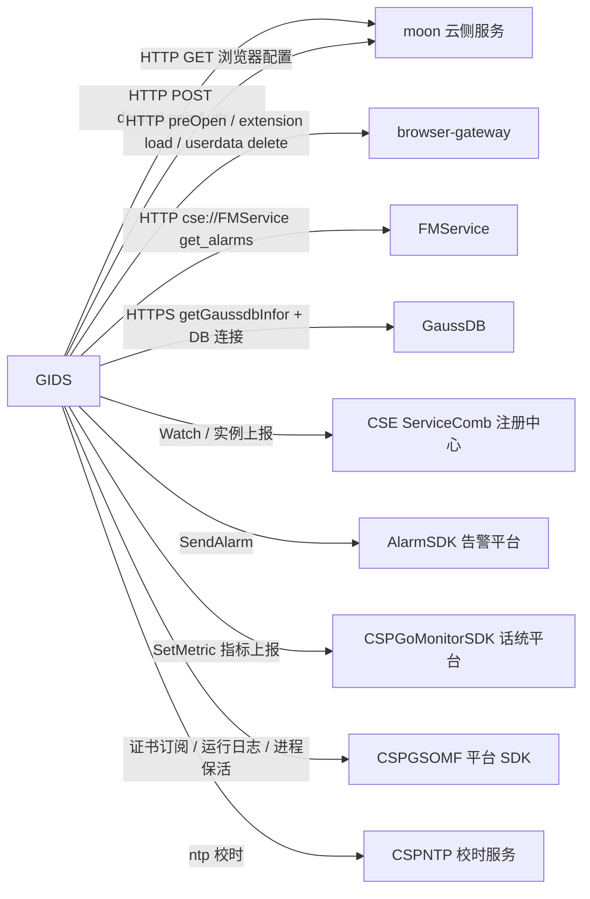

# 通信规范（外部服务调用）

| 元信息 | 值 |
|--------|-----|
| 分支 | new_skill_test 分支 (2026-08-11) |
| 更新日期 | 2026-08-11 |
| Skill | tech-comm-guidelines-analyze |
| 运行模式 | 提取模式 |

## 外部服务全景

| 服务名 | 协议 | 接口数 | 主要业务域 | 归属判定依据 | 子文档 |
|---|---|---|---|---|---|
| moon | HTTP/HTTPS | 2 | 终端鉴权登录、浏览器配置同步 | 配置 key `moon::titokEndpoint` / `moon::configEndpoint` | [comm-guidelines-moon.md](comm-guidelines-moon.md) |
| browser-gateway | HTTP | 3 | 浏览器实例预热、插件加载、页面缓存删除 | 服务发现名 `browser-gateway`（src/common/cse/cse.go） | [comm-guidelines-browser-gateway.md](comm-guidelines-browser-gateway.md) |
| FMService | HTTP（go-chassis rest，cse:// 寻址） | 1 | 活动告警查询与清除 | 显式服务名 `FMService`（src/service/alarm_service.go） | [comm-guidelines-fmservice.md](comm-guidelines-fmservice.md) |
| GaussDB | HTTPS + DB 连接（openGauss/pq） | 2 | 数据库连接信息获取、业务数据持久化 | 配置 key `gaussdb::servicename` / 环境变量 `DB_SERVICE_NAME` | [comm-guidelines-gaussdb.md](comm-guidelines-gaussdb.md) |
| cse-servicecomb | go-chassis GSF/Registry API | 3 | 服务注册发现、browser-gateway 实例 Watch、实例属性上报 | client 类 `api.Registry`（src/common/cse/cse.go） | [comm-guidelines-cse-servicecomb.md](comm-guidelines-cse-servicecomb.md) |
| alarm-sdk | AlarmSDK（CSPAlarmManager） | 2 | 告警上报与清除 | client 类 `AlarmSDK_GO/api/alarmapi` | [comm-guidelines-alarm-sdk.md](comm-guidelines-alarm-sdk.md) |
| csp-go-monitor-sdk | CSPGoMonitorSDK（MonSdkInstance） | 4 | 话统指标注册与定时上报 | client 类 `CSPGoMonitorSDK/api/monitor` | [comm-guidelines-csp-go-monitor-sdk.md](comm-guidelines-csp-go-monitor-sdk.md) |
| cspsomf-sdk | CSPGSOMF 平台 SDK（Cert/Transport/Runlog/Modulekeeper） | 4 | 证书订阅、传输通道、运行日志、进程保活上报 | SDK 包名 `CSPGSOMF/*SDK` | [comm-guidelines-cspsomf-sdk.md](comm-guidelines-cspsomf-sdk.md) |
| cspntp-sdk | CSPNTP_SDK_GO | 1 | NTP 时间校时初始化 | SDK 包名 `CSPNTP_SDK_GO/api` | [comm-guidelines-cspntp-sdk.md](comm-guidelines-cspntp-sdk.md) |

## 附注

- 预留死代码：Redis 客户端封装（src/common/storage/redis/redis.go）存在但全仓业务代码（src/service、src/controllers、src/dao）无任何调用方，未计入接口清单。
- 预留死代码：OSS/minio 客户端封装（src/common/storage/oss/minio.go）存在但全仓业务代码无任何调用方，未计入接口清单。
