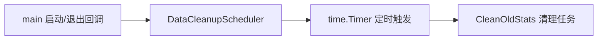

# DataCleanupScheduler 并发规范

| 元信息 | 值 |
|--------|-----|
| 分支 | new_skill_test 分支 (2026-08-11) |
| 更新日期 | 2026-08-11 |
| Skill | tech-concurrency-guidelines-analyze |
| 运行模式 | 起草模式 |
| 实例类型 | 定时任务 |

## 用途定位

数据清理调度器：每日凌晨 2 点触发一次历史流量统计数据清理（`CleanOldStats(CleanupMonths)`），失败重试最多 3 次、每次间隔 10 分钟。从定义处注释与 `executeCleanup` 实现推断。

- 代码标识符：`DataCleanupScheduler` / `globalScheduler`
- 定义位置：src/scheduler/task_scheduler.go
- 使用点（任务提交 / 加锁 / 消息投递位置）：src/main.go（`scheduler.StartDataCleanupScheduler()`）；src/main.go（`GracefulExitHandler.Exit` 中 `StopDataCleanupScheduler()`）

## 线程模型（可选）

## 容量 / 队列 / 拒绝策略现状（代码现状）

> 本节只写**代码事实**，逐条附证据文件路径（不带行号）；读不到写「未设置」或「框架默认」，禁止臆造取值。

| 维度 | 现状 | 证据（文件路径） |
|---|---|---|
| 池化方式 | 裸 goroutine（无池化），单实例 `go s.run()` | src/scheduler/task_scheduler.go |
| 容量配置 | 未设置（单 goroutine）；重试参数硬编码 maxRetries=3、retryInterval=10min | src/scheduler/task_scheduler.go |
| 任务队列 | 无队列；`stopChan chan struct{}` 无缓冲用于停止信号 | src/scheduler/task_scheduler.go |
| 拒绝策略 | 未设置；`Start()` 在 `isRunning=true` 时直接忽略重复启动 | src/scheduler/task_scheduler.go |
| 隔离范围 | 独占 goroutine，仅执行数据清理任务 | src/scheduler/task_scheduler.go |
| 关闭与等待 | `Stop()` 中 `close(stopChan)` + `waitGroup.Wait()`；重试间隔用 `sleepWithStopCheck` 可中断等待 | src/scheduler/task_scheduler.go |
| 调度并发语义 | 单 goroutine 串行执行，不允许重入（同一时刻只有一个 run 循环）；`executeCleanup` 持 `s.mu` 执行，任务体内未再开并发 | src/scheduler/task_scheduler.go |

## 应有约定建议（建议）

> 本节为**建议**（规范初稿，尚未在代码中落地），与上节「代码现状」严格区分；落地后相应内容转入现状节、从本节移除。

| 维度 | 建议约定 | 理由 |
|---|---|---|
| 池选型 | 单实例定时任务允许裸 goroutine，但应有明确的 Start/Stop 生命周期（现状已具备，保持） | 任务低频且独占，池化无收益 |
| 容量基线 | 重试次数与间隔建议外置到配置（beego AppConfig），避免硬编码变更需重新发布 | 运维可调，避免改代码 |
| 拒绝策略 | `executeCleanup` 持 `s.mu` 执行会阻塞 Stop() 中的 `mu.Lock()` 直至清理完成，建议清理临界区不持锁或用独立状态锁 | 避免长任务阻塞优雅退出 |
| 隔离 | 保持独占，不与业务请求路径共用 goroutine | 清理慢不影响在线请求 |
| 命名与观测 | 建议上报「上次执行时间/执行结果」指标到 MonitorService | 调度静默失败难发现 |
