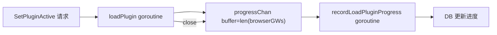

# progressChan 插件加载进度管道 并发规范

| 元信息 | 值 |
|--------|-----|
| 分支 | new_skill_test 分支 (2026-08-11) |
| 更新日期 | 2026-08-11 |
| Skill | tech-concurrency-guidelines-analyze |
| 运行模式 | 起草模式 |
| 实例类型 | channel + 裸并发(goroutine) |

## 用途定位

插件激活后异步加载链路：`SetPluginActive` 返回前启动两个 goroutine——`loadPlugin` 逐个 BrowserGW 调用插件加载接口并把进度写入 `progressChan`，`recordLoadPluginProgress` 消费进度更新 DB；加载完成后生产者 `close(progressChan)` 使消费者退出。从实现推断。

- 代码标识符：`progressChan` / `PluginServiceImpl.loadPlugin` / `PluginServiceImpl.recordLoadPluginProgress`
- 定义位置：src/service/plugin_service.go
- 使用点（任务提交 / 加锁 / 消息投递位置）：src/service/plugin_service.go（`SetPluginActive` 中 `go p.loadPlugin(...)`、`go p.recordLoadPluginProgress(...)`）

## 线程模型（可选）

## 容量 / 队列 / 拒绝策略现状（代码现状）

> 本节只写**代码事实**，逐条附证据文件路径（不带行号）；读不到写「未设置」或「框架默认」，禁止臆造取值。

| 维度 | 现状 | 证据（文件路径） |
|---|---|---|
| 池化方式 | 裸 goroutine（无池化），每次激活插件起 2 个 goroutine | src/service/plugin_service.go |
| 容量配置 | 未设置；代码注释明确「不考虑任务并发执行」（`switchActivePlugin`），但无互斥手段保证 | src/service/plugin_service.go |
| 任务队列 | 有界 channel，buffer = `len(browserGWs)`（按实例数动态） | src/service/plugin_service.go |
| 拒绝策略 | 未设置；生产者向已 close 或满 channel 写入的防护依赖 buffer=实例数+最后一次写入的容量设计 | src/service/plugin_service.go |
| 隔离范围 | 每次激活独立 channel 与 goroutine 对，互不共享 | src/service/plugin_service.go |
| 关闭与等待 | 生产者 `loadPlugin` 结束时 `close(progressChan)`；消费者 `for range` 随关闭退出；无 WaitGroup，API 不等任务完成 | src/service/plugin_service.go |
| 消息缓冲与背压 | buffer=实例数，理论上生产者最多写 实例数+1 次（末次状态写入），buffer 可能不足导致生产者短暂阻塞至消费者消费，属可接受阻塞背压 | src/service/plugin_service.go |

## 应有约定建议（建议）

> 本节为**建议**（规范初稿，尚未在代码中落地），与上节「代码现状」严格区分；落地后相应内容转入现状节、从本节移除。

| 维度 | 建议约定 | 理由 |
|---|---|---|
| 池选型 | 每激活 2 个 goroutine 可接受；若需支持并发激活，应以任务 ID 为 key 管理任务句柄 | 当前注释「不考虑任务并发」但无强制手段 |
| 容量基线 | 建议加互斥（如 `sync.Mutex` 或 DB 状态 CAS）保证同一时刻只有一个加载任务，把「不考虑并发」从注释变成机制 | 防止并发激活导致状态错乱 |
| 拒绝策略 | 已有进行中任务时新激活请求应快速失败（code + 提示） | 明确拒绝语义优于静默交错 |
| 隔离 | 保持任务间 channel 独立 | — |
| 命名与观测 | 代码注释已标注「未考虑重试、未考虑服务重启中断、未记录失败节点」，建议这些作为待办进入设计文档并跟踪 | 中断后进度状态可能停留在 Doing |
